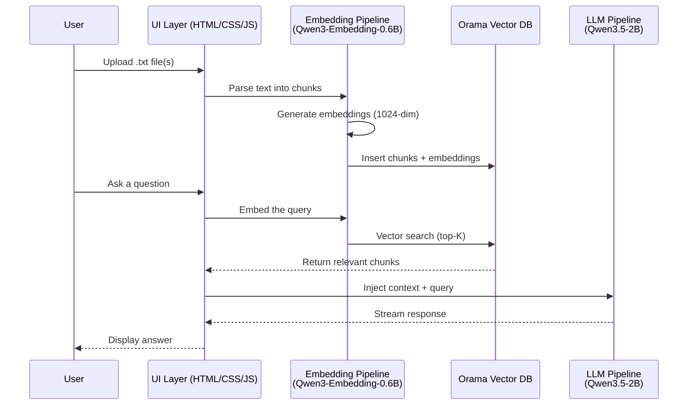

# Product Requirement Document: Browser-Based RAG Agent

| Field          | Value                                                    |
|----------------|----------------------------------------------------------|
| **Project**    | RAG-Browser — Client-Side RAG Agent                      |
| **Version**    | 1.0                                                      |
| **Date**       | 2026-06-13                                               |
| **Status**     | Draft                                                    |
| **Author**     | Product Engineering                                      |

---

## 1. Executive Summary

**RAG-Browser** is a fully client-side, browser-based Retrieval-Augmented Generation (RAG) agent that enables users to upload `.txt` documents, embed them locally, and query them conversationally — without any server-side computation, API calls, or cloud infrastructure.

All AI inference, vector storage, search, and language generation runs entirely within the user's browser using:
- **Transformers.js v4** for model inference (ONNX runtime on WebGPU / WASM)
- **Qwen3-Embedding-0.6B** for text embedding generation
- **Qwen3.5-2B** for conversational response generation
- **Orama** as the in-memory vector database and full-text search engine

The server serves only static files (HTML, CSS, JavaScript). The application is completely privacy-preserving: no user data ever leaves the client device.

---

## 2. Problem Statement

Current RAG applications require:
- A backend server running embedding models and vector databases
- API calls to cloud LLM providers (cost, latency, rate limits)
- User data transmitted over the network (privacy concerns, compliance risks)

For users with sensitive documents, offline requirements, or cost-sensitive deployments, this architecture is unacceptable. RAG-Browser eliminates all these dependencies by running the entire pipeline in the browser.

### 2.1 Target Users

| User Segment          | Use Case                                              |
|-----------------------|-------------------------------------------------------|
| Privacy-conscious users | Analyze personal/sensitive documents without cloud exposure |
| Developers/Researchers  | Prototype RAG workflows without infrastructure        |
| Enterprises (HIPAA/GDPR)| Process regulated data entirely on-prem/client-side   |
| Offline environments    | Work in air-gapped or low-connectivity scenarios      |

---

## 3. Technical Architecture

### 3.1 High-Level Architecture



### 3.2 Component Breakdown

| Component           | Technology                        | Responsibility                                          |
|---------------------|-----------------------------------|---------------------------------------------------------|
| Embedding Model     | Qwen3-Embedding-0.6B (ONNX)      | Generate 1024-dimensional embedding vectors for text   |
| Language Model      | Qwen3.5-2B (ONNX)                | Conversational response generation with RAG context    |
| Vector Database     | Orama (in-memory)                 | Store, index, and search embeddings + full-text index  |
| Inference Runtime   | Transformers.js v4                | ONNX model execution via WebGPU (primary) or WASM (fallback) |
| Delivery            | Static HTML/CSS/JS + CDN          | Zero-server architecture                                |

### 3.3 Model Specifications

#### Qwen3-Embedding-0.6B

| Property               | Value                                       |
|------------------------|---------------------------------------------|
| Parameters             | 0.6B                                        |
| Output Dimensions      | Up to 1024 (Matryoshka: 32–1024 configurable)|
| Context Length         | 32,768 tokens                               |
| Languages              | 100+                                        |
| Instruction-Aware      | Yes                                         |
| MRL Support            | Yes (flexible truncation)                   |
| ONNX Variant           | `onnx-community/Qwen3-Embedding-0.6B-ONNX`  |
| Quantization Options   | fp32, fp16, q8, q4, q4fp16                 |

#### Qwen3.5-2B

| Property               | Value                                          |
|------------------------|------------------------------------------------|
| Parameters             | 2.27B                                          |
| Architecture           | Gated DeltaNet + Gated Attention (hybrid)      |
| Context Length         | 262,144 tokens (native)                         |
| Languages              | 201                                            |
| Multimodal             | Yes (text + image input, text output)           |
| License                | Apache 2.0                                     |
| ONNX Variant           | `huggingworld/Qwen3.5-2B-ONNX`                 |
| Quantization Options   | q4, q4fp16 (embed_tokens, vision_encoder, decoder_model_merged) |
| Thinking Mode          | Non-thinking by default                         |

### 3.4 Transformers.js v4 Runtime

| Feature                  | Detail                                                     |
|--------------------------|------------------------------------------------------------|
| Version                  | v4 (production-ready, released 2025)                       |
| Primary Acceleration     | WebGPU (up to 100x faster than WASM)                       |
| Fallback                 | WebAssembly (WASM)                                         |
| Browser Support          | Chrome 113+, Edge 113+, Safari 18+, Firefox 134+           |
| Worker Support           | Yes (recommended to avoid main-thread blocking)            |
| CDN                      | `https://cdn.jsdelivr.net/npm/@huggingface/transformers@4.2.0` |
| Model Compatibility      | 500+ ONNX models on Hugging Face Hub                       |

### 3.5 Orama Vector Database

| Feature                  | Detail                                                     |
|--------------------------|------------------------------------------------------------|
| Size                     | ~2KB gzipped (core library)                                |
| Search Modes             | Full-text, Vector, Hybrid                                  |
| Storage                  | In-memory (no persistence by default)                      |
| Persistence Plugin       | `@orama/plugin-persistence` (IndexedDB for browser storage) |
| Platform                 | Browser, Node.js, Deno, Edge runtimes                      |
| Dependencies             | Zero                                                       |
| CDN Availability         | Yes                                                        |

---

## 4. Functional Requirements

### 4.1 Document Ingestion

| ID   | Requirement                                                  | Priority |
|------|--------------------------------------------------------------|----------|
| FR-1 | User can upload one or more `.txt` files via file picker     | P0       |
| FR-2 | System parses uploaded text and splits it into chunks         | P0       |
| FR-3 | Chunk size is configurable (default: 512 tokens, ± overlap)  | P1       |
| FR-4 | System generates embeddings for each chunk using Qwen3-Embedding-0.6B | P0 |
| FR-5 | Embeddings and text chunks are inserted into Orama            | P0       |
| FR-6 | User sees progress indicators during ingestion                | P0       |
| FR-7 | User sees an error if the file format is unsupported         | P1       |

#### Chunking Strategy

- Split text by semantic boundaries (paragraphs, double newlines) when possible
- Fallback to token-based splitting with configurable overlap (default: 10–15% overlap)
- Each chunk stored with metadata: source file name, chunk index, character offset

### 4.2 Vector Search & Retrieval

| ID   | Requirement                                                  | Priority |
|------|--------------------------------------------------------------|----------|
| FR-8 | User query is embedded using the same embedding model        | P0       |
| FR-9 | Orama performs vector search (cosine similarity)             | P0       |
| FR-10| System returns top-K relevant chunks (configurable, default: 5) | P1    |
| FR-11| Hybrid search (vector + full-text) is available as an option | P2       |
| FR-12| Retrieved chunks are included as context in the LLM prompt   | P0       |

### 4.3 Conversational Interface

| ID   | Requirement                                                  | Priority |
|------|--------------------------------------------------------------|----------|
| FR-13| User can type questions in a chat-style interface            | P0       |
| FR-14| Qwen3.5-2B generates responses with RAG context injected    | P0       |
| FR-15| Response is streamed token-by-token to the UI                 | P0       |
| FR-16| Conversation history is maintained for multi-turn dialogue   | P1       |
| FR-17| User can stop generation mid-stream                          | P1       |
| FR-18| Retrieved source chunks are cited in the response            | P1       |
| FR-19| User can clear conversation history                          | P1       |

### 4.4 System Initialization

| ID   | Requirement                                                  | Priority |
|------|--------------------------------------------------------------|----------|
| FR-20| On page load, system detects hardware capabilities           | P0       |
| FR-21| System auto-selects WebGPU (fp16) or WASM (q8/q4) based on GPU support | P0 |
| FR-22| Models are loaded lazily (on-demand) to minimize startup time | P0       |
| FR-23| Model download progress is visible to the user               | P0       |
| FR-24| Models are cached via browser cache / service worker for subsequent visits | P1 |
| FR-25| System reports device memory (`navigator.deviceMemory`) for configuration tuning | P1 |

### 4.5 Memory Management

| ID   | Requirement                                                  | Priority |
|------|--------------------------------------------------------------|----------|
| FR-26| Models are disposed (`model.dispose()`) when no longer needed | P0       |
| FR-27| User can unload models to free memory                        | P1       |
| FR-28| System warns user if document load may exceed memory capacity | P1       |
| FR-29| Embedding model can be unloaded after ingestion, freeing memory for the LLM | P1 |

---

## 5. Non-Functional Requirements

### 5.1 Performance

| ID    | Requirement                                                  | Target                    |
|-------|--------------------------------------------------------------|---------------------------|
| NFR-1 | Initial page load (no models)                                | < 3 seconds               |
| NFR-2 | Embedding model load time (WebGPU)                           | < 30 seconds              |
| NFR-3 | LLM model load time (WebGPU, q4 quantization)                | < 60 seconds              |
| NFR-4 | Embedding generation speed                                   | > 100 chunks/second       |
| NFR-5 | LLM token generation speed (WebGPU, q4)                      | > 10 tokens/second        |
| NFR-6 | Vector search latency                                        | < 50ms for < 10,000 chunks|
| NFR-7 | UI remains responsive during background operations           | Always (use Web Workers)  |

### 5.2 Privacy & Security

| ID    | Requirement                                                  |
|-------|--------------------------------------------------------------|
| NFR-8 | Zero data leaves the client device                           |
| NFR-9 | No API keys, no cloud calls, no telemetry                    |
| NFR-10| All processing occurs in-browser                             |
| NFR-11| No server-side logging or analytics                          |
| NFR-12| CSP (Content Security Policy) configured for CDN sources only|

### 5.3 Compatibility

| ID    | Requirement                                                  |
|-------|--------------------------------------------------------------|
| NFR-13| Chrome 113+ (WebGPU), fallback to WASM for older browsers   |
| NFR-14| Edge 113+                                                    |
| NFR-15| Safari 18+ (macOS/iOS)                                       |
| NFR-16| Firefox 134+                                                 |
| NFR-17| Desktop and mobile browsers                                  |
| NFR-18| Responsive design for viewport widths 320px–2560px+          |

### 5.4 Scalability

| ID    | Requirement                                                  |
|-------|--------------------------------------------------------------|
| NFR-19| Support for document collections up to 50,000 chunks         |
| NFR-20| Graceful degradation when memory is constrained              |
| NFR-21| Configurable embedding dimensions (MRL: 32–1024) to trade accuracy for memory |

### 5.5 Reliability

| ID    | Requirement                                                  |
|-------|--------------------------------------------------------------|
| NFR-22| Graceful error handling for failed model downloads           |
| NFR-23| Recovery from browser tab suspension/resume                  |
| NFR-24| Clear user-facing error messages for all failure modes       |

---

## 6. User Experience Requirements

### 6.1 Application Flow

```mermaid
flowchart TD
    A[Page Load] --> B{Hardware Check}
    B -->|WebGPU Available| C[Load Models<br/>(WebGPU / fp16)]
    B -->|No WebGPU| D[Load Models<br/>(WASM / q8)]
    C --> E[Ready State]
    D --> E
    E --> F[User Uploads .txt Files]
    F --> G[Chunk & Embed Documents]
    G --> H[Insert into Orama Index]
    H --> I[Index Ready]
    I --> J[User Asks Question]
    J --> K[Embed Query]
    K --> L[Vector Search Top-K]
    L --> M[Build RAG Prompt]
    M --> N[Generate Response<br/>(Streaming)]
    N --> O[Display Answer + Citations]
    O --> J
```

### 6.2 UI Layout

The application should present three primary sections:

| Section           | Description                                                |
|-------------------|------------------------------------------------------------|
| **Sidebar**       | Document management: upload, list, remove, index status    |
| **Chat Panel**    | Conversational interface with message history and streaming |
| **Status Bar**    | System status: model state, memory usage, index size, hardware config |

### 6.3 Progress Feedback

All long-running operations must provide real-time feedback:
- Model download: percentage + file size
- Chunking: chunks processed / total
- Embedding generation: progress bar + ETA
- Search: retrieval time display
- Generation: streaming tokens + stop button

---

## 7. Data Model

### 7.1 Document Chunk Schema (Orama)

```typescript
interface DocumentChunk {
  id: string;                  // Unique identifier (UUID)
  content: string;             // The text chunk
  embedding: number[];         // 1024-dimensional vector (or truncated)
  metadata: {
    sourceFile: string;        // Original filename
    chunkIndex: number;        // Position within source file
    charOffset: number;        // Character start offset in source
    charLength: number;        // Character length of chunk
  };
}
```

### 7.2 Conversation Message Schema

```typescript
interface ConversationMessage {
  id: string;                  // Unique identifier
  role: 'user' | 'assistant' | 'system';
  content: string;             // Message text
  timestamp: number;           // Epoch milliseconds
  contextChunks?: string[];    // IDs of retrieved chunks (for assistant)
}
```

### 7.3 System State

```typescript
interface AppState {
  hardware: {
    webgpuAvailable: boolean;
    device: 'webgpu' | 'wasm';
    dtype: string;
    deviceMemoryGB: number | undefined;
  };
  models: {
    embedding: 'unloaded' | 'loading' | 'ready';
    llm: 'unloaded' | 'loading' | 'ready';
  };
  index: {
    totalChunks: number;
    totalDocuments: number;
    embeddingDimension: number;
  };
  conversation: ConversationMessage[];
}
```

---

## 8. RAG Pipeline Specification

### 8.1 Ingestion Pipeline


1. **Parse**: Read `.txt` file content as UTF-8 text
2. **Chunk**: Split into overlapping chunks (configurable size, default 512 tokens)
3. **Instruction**: Wrap query chunks with task instruction per the embedding model's format:
   ```
   Instruct: Given a web search query, retrieve relevant passages that answer the query
   Query: {chunk_text}
   ```
   Document chunks are embedded without instruction wrapper.
4. **Embed**: Generate normalized embedding vectors via Transformers.js `feature-extraction` pipeline
5. **Index**: Insert chunks + embeddings into Orama with vector search enabled

### 8.2 Retrieval Pipeline

1. **Wrap query** with the same instruction template used during ingestion
2. **Embed** the query using the embedding model
3. **Search** Orama for top-K most similar chunks (cosine similarity)
4. **Rank** results by similarity score
5. **Return** top-K chunks as context

### 8.3 Generation Pipeline

1. **Build system prompt** with RAG context:
   ```
   You are a helpful assistant. Answer the user's question using ONLY the
   provided context. If the context does not contain enough information, say
   so clearly. Cite your sources by referencing the document chunks.

   Context:
   [{chunk_1_content}]
   [{chunk_2_content}]
   ...

   Question: {user_query}
   ```
2. **Apply chat template** using `processor.apply_chat_template()`
3. **Generate** via `model.generate()` with `TextStreamer` for streaming output
4. **Stream tokens** to the UI in real-time
5. **Decode** final output for conversation history storage

---

## 9. Technology Stack Summary

| Layer              | Technology                          | Version  | Source                        |
|--------------------|-------------------------------------|----------|-------------------------------|
| Embedding Model    | Qwen3-Embedding-0.6B (ONNX)        | Latest   | Hugging Face Hub              |
| LLM                | Qwen3.5-2B (ONNX)                  | Latest   | Hugging Face Hub              |
| Inference Runtime  | Transformers.js                     | 4.2.0+   | CDN (jsDelivr)                |
| Vector Database    | Orama                               | 3.1.x    | CDN (jsDelivr / npm)          |
| UI Framework       | Vanilla HTML/CSS/JS                 | —        | Static files                  |
| Delivery           | Static web server                   | —        | HTML, CSS, JS only            |

---

## 10. Constraints & Assumptions

### 10.1 Constraints

| ID    | Constraint                                                                 |
|-------|----------------------------------------------------------------------------|
| C-1   | Server hosts only static files (HTML, CSS, JavaScript). No backend logic.  |
| C-2   | No server-side computation, storage, or API calls.                         |
| C-3   | Only `.txt` files supported for ingestion (MVP).                           |
| C-4   | CDN usage is allowed for libraries and models.                             |
| C-5   | Must work offline after initial model download (service worker caching).   |
| C-6   | Memory-limited environment: typical browser tab limit ~4–8 GB on consumer devices |

### 10.2 Assumptions

| ID    | Assumption                                                                 |
|-------|----------------------------------------------------------------------------|
| A-1   | Target users have devices with WebGPU-capable browsers (Chrome 113+, etc.) |
| A-2   | Target users have ≥ 8 GB RAM for comfortable model loading                 |
| A-3   | Documents are reasonably sized (< 10 MB per file, < 50 files total for MVP) |
| A-4   | Users have stable internet for initial model download (~500 MB–2 GB total) |
| A-5   | Qwen3.5-2B in q4 quantization provides acceptable response quality         |

---

## 11. Risk Assessment

| Risk | Impact | Likelihood | Mitigation |
|------|--------|------------|------------|
| WebGPU not available on user's browser | High | Medium | WASM fallback with q8 quantization; clear hardware requirements communicated upfront |
| Model download fails (large files, unstable connection) | High | Medium | Resume-capable downloads; progress indicators; chunked model loading |
| Out-of-memory during large document ingestion | High | Medium | Chunk size limits; memory warnings; graceful error handling; model unload option |
| Slow inference on low-end hardware | Medium | Medium | Adaptive quantization; Web Worker offloading; performance expectations set clearly |
| Transformers.js v4 API changes | Medium | Low | Pin specific version (4.2.0); abstraction layer around model loading |
| Browser tab suspension kills model state | Medium | Low | IndexedDB persistence for index; re-load prompt on resume |
| Qwen3.5-2B produces hallucinated answers | Medium | Medium | System prompt constraints; source citations; "I don't know" fallback |

---

## 12. Implementation Plan

### Phase 1: Foundation (Weeks 1–2)

- [ ] Project scaffolding: HTML, CSS, JS structure
- [ ] Hardware detection (WebGPU, device memory)
- [ ] Transformers.js integration with lazy model loading
- [ ] Embedding model load + test with sample text
- [ ] LLM model load + test with simple conversation
- [ ] Basic UI: status bar, loading states

### Phase 2: Document Ingestion (Weeks 3–4)

- [ ] File upload UI and handler
- [ ] Text chunking engine with configurable parameters
- [ ] Embedding generation pipeline
- [ ] Orama integration: schema, insertion, indexing
- [ ] Progress feedback for ingestion
- [ ] Memory management: model dispose/unload

### Phase 3: RAG Pipeline (Weeks 5–6)

- [ ] Query embedding and vector search
- [ ] Top-K retrieval with similarity scoring
- [ ] RAG prompt construction with context injection
- [ ] LLM generation with streaming output
- [ ] Source citation display

### Phase 4: Polish & UX (Weeks 7–8)

- [ ] Chat interface with conversation history
- [ ] Multi-turn dialogue support
- [ ] Stop generation control
- [ ] Document management sidebar
- [ ] Responsive design and mobile support
- [ ] Error handling and user feedback

### Phase 5: Optimization & Hardening (Weeks 9–10)

- [ ] Web Worker offloading for non-blocking inference
- [ ] Service worker for offline model caching
- [ ] IndexedDB persistence for document index
- [ ] Performance benchmarking and tuning
- [ ] Cross-browser testing
- [ ] Documentation

---

## 13. Acceptance Criteria

| ID    | Criterion                                                        | Verification Method         |
|-------|------------------------------------------------------------------|-----------------------------|
| AC-1  | Application loads and initializes without errors                 | Manual test in target browsers |
| AC-2  | User can upload a `.txt` file and see it indexed                 | Functional test             |
| AC-3  | Embeddings are generated and stored in Orama                     | Debug: verify vector dimensions |
| AC-4  | Query returns relevant chunks from the index                     | Functional test with known documents |
| AC-5  | LLM generates a response incorporating retrieved context         | Functional test             |
| AC-6  | Response is streamed to the UI in real-time                      | Visual verification         |
| AC-7  | Retrieved source chunks are cited                                | Visual verification         |
| AC-8  | Application works on WebGPU-enabled browsers                     | Test on Chrome/Edge/Safari  |
| AC-9  | Application falls back to WASM when WebGPU is unavailable        | Test with WebGPU disabled   |
| AC-10 | No network requests are made during operation (post-model load)  | Network tab verification    |
| AC-11 | Models can be unloaded to free memory                            | Memory tab verification     |
| AC-12 | UI remains responsive during long-running operations             | Visual verification         |

---

## 14. Out of Scope (Future Work)

The following are explicitly excluded from the MVP but identified as potential future enhancements:

| Feature                      | Notes                                           |
|------------------------------|--------------------------------------------------|
| PDF/DOCX/Markdown ingestion  | Requires additional parsing libraries            |
| Web page ingestion           | Requires fetch + HTML parsing                    |
| Image understanding          | Qwen3.5-2B supports images; could be added later |
| Voice interaction            | Web Speech API integration                       |
| Multi-document filtering     | Filter retrieved results by source document      |
| Fine-tuning / prompt presets | Customizable system prompts and templates        |
| Plugin architecture          | Extensible embedding/generation backends         |
| Collaborative / shared indexes| Requires persistence + sync (server needed)      |
| Export / share conversations | PDF export, markdown copy                        |

---

## 15. References

| Resource                                                | Description                                      |
|---------------------------------------------------------|--------------------------------------------------|
| [Transformers.js GitHub](https://github.com/huggingface/transformers.js/) | Official Transformers.js repository               |
| [Orama Documentation](https://docs.orama.com/)          | Orama search engine documentation                |
| [Qwen3-Embedding-0.6B (Hugging Face)](https://huggingface.co/Qwen/Qwen3-Embedding-0.6B) | Embedding model card                             |
| [Qwen3.5-2B (Hugging Face)](https://huggingface.co/Qwen/Qwen3.5-2B) | Language model card                              |
| [Qwen3.5 Blog Post](https://qwen.ai/blog?id=qwen3.5)   | Qwen3.5 release blog                             |
| [Reference: minimal-qwen3-embedding-0.6b.html](data/minimal-qwen3-embedding-0.6b.html) | Embedding model reference implementation         |
| [Reference: minimal-qwen3.5-2b.html](data/minimal-qwen3.5-2b.html) | LLM reference implementation                     |

---

## 16. Glossary

| Term            | Definition                                                                     |
|-----------------|--------------------------------------------------------------------------------|
| RAG             | Retrieval-Augmented Generation: pattern combining vector search with LLM generation |
| Embedding       | Dense numerical vector representation of text that captures semantic meaning   |
| WebGPU          | Browser API for hardware-accelerated graphics and compute (GPU inference)      |
| WASM            | WebAssembly: portable binary format for near-native performance in browsers    |
| ONNX            | Open Neural Network Exchange: framework-agnostic model format                  |
| Quantization    | Reducing model precision (fp32 → fp16 → q8 → q4) to save memory/speed up inference |
| MRL             | Matryoshka Representation Learning: technique enabling variable-length embeddings |
| Top-K           | Number of most relevant results returned by the search                         |
| Chunk           | A segment of text small enough to embed as a single vector                     |
| Cosine Similarity | Measure of similarity between two vectors based on the angle between them   |
