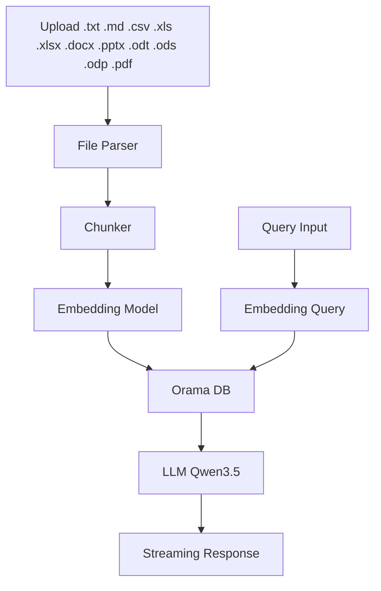

# RAG-Browser

A fully client-side, browser-based **Retrieval-Augmented Generation (RAG)** agent. Upload documents (`.txt`, `.md`, `.csv`, `.xls`, `.xlsx`, `.docx`, `.pptx`, `.odt`, `.ods`, `.odp`, `.pdf`), embed them locally, and query them conversationally — all without a server, API keys, or cloud infrastructure.

## Overview

RAG-Browser runs the entire AI pipeline inside your browser:

- **Embedding** — `Qwen3-Embedding-0.6B` converts document chunks to vectors
- **Vector Search** — [Orama](https://orama.com) provides in-memory vector storage and retrieval, with configurable BM25/semantic hybrid search modes
- **Generation** — `Qwen3.5-2B` produces conversational responses grounded in your documents
- **Inference Runtime** — [Transformers.js v4](https://huggingface.co/docs/transformers.js) (ONNX on WebGPU / WASM)

The server serves only static files. **No user data ever leaves your device.**

## Architecture



## Key Features

- **Multi-Format Ingestion** — Supports `.txt`, `.md`, `.csv`, `.xls`, `.xlsx`, `.docx`, `.pptx`, `.odt`, `.ods`, `.odp`, `.pdf` (legacy `.doc`/`.ppt` binary formats are unsupported in-browser)
- **100% Client-Side** — No backend, no API calls, no cloud dependencies
- **Privacy-First** — All processing happens locally; nothing leaves your device
- **WebGPU Acceleration** — GPU-accelerated inference via ONNX Runtime Web
- **Offline Support** — Service worker caches static assets for offline use
- **IndexedDB Persistence** — Document index survives page reloads
- **Database Portability** — Export and import document indexes as JSON files
- **Hybrid Search (BM25 + Semantic)** — Configurable keyword vs. semantic balance with separate similarity thresholds
- **Search Mode Toggle** — Switch between Hybrid and Vector-only search modes
- **Thinking Mode Toggle** — Enable or disable Qwen3.5's reasoning mode; thinking output renders as collapsible blocks
- **Adjustable Thinking Budget** — Control the maximum tokens allocated to the model's internal reasoning (256–2048, default 1024) when thinking mode is active
- **Streaming Responses** — Token-by-token output for responsive UX
- **Multi-turn Conversations** — Context-aware dialogue with your documents
- **Model Lifecycle Control** — Independent load/unload controls for embedding model and LLM to manage memory

## Technology Stack

| Component              | Technology                                       |
|------------------------|---------------------------------------------------|
| Embedding Model        | Qwen3-Embedding-0.6B (ONNX)                       |
| LLM                    | Qwen3.5-2B (ONNX, q4 quantized)                   |
| Inference Runtime      | Transformers.js v4                                |
| Vector Database        | Orama v3.1.x                                      |
| Document Parser        | officeParser 7.2.0 (CDN, lazy-loaded)                  |
| PDF Parser             | PDF.js 4.9.155 (Mozilla, CDN, lazy-loaded)             |
| Acceleration           | WebGPU (with WASM fallback)                       |
| Persistence            | IndexedDB                                         |
| Offline                | Service Worker + CDN caching                      |

## Project Structure

```
rag-v2-qwen3.6-27b/
├── index.html           # Main application shell
├── sw.js                # Service worker (offline caching)
├── favicon.svg          # Favicon
├── css/                           # Application styling
│   └── styles.css
├── js/                            # Application logic
│   ├── app.js                     # Application entry point & orchestration
│   ├── hardware.js                # WebGPU detection & hardware capabilities
│   ├── state.js                   # Centralized application state (pub/sub)
│   ├── embedding.js               # Embedding model loading & inference
│   ├── llm.js                     # LLM loading, generation & streaming
│   ├── chunker.js                 # Document chunking with overlap strategy
│   ├── fileParser.js              # Multi-format file parsing (officeParser)
│   ├── orama-db.js                # Orama vector DB + IndexedDB persistence
│   ├── rag-pipeline.js            # Ingestion, retrieval & generation pipeline
│   ├── renderer.js                # Token-by-token DOM rendering for streaming messages
│   ├── ui.js                      # DOM rendering & general UI updates
│   └── utils.js                   # Helpers (UUID, token estimation, formatting)
├── data/                          # Minimal test pages for individual models
├── debug_data/                    # Debug screenshots and diagnostics
├── PRD.md                         # Product Requirements Document
└── IMPLEMENTATION_PLAN.md         # Detailed implementation plan
```

## Module Responsibilities

| Module            | Responsibility                                    |
|-------------------|---------------------------------------------------|
| `hardware.js`     | Detect WebGPU, device memory, select dtype        |
| `state.js`        | Central state management with subscriber pattern  |
| `embedding.js`    | Load/unload embedding model, generate embeddings  |
| `llm.js`          | Load/unload LLM, stream token generation          |
| `chunker.js`      | Split text into chunks with paragraph awareness        |
| `fileParser.js`   | Parse multi-format documents to plain text             |
| `orama-db.js`     | Create DB, insert chunks, vector search, persist       |
| `rag-pipeline.js` | Orchestrate ingestion → embedding → retrieval     |
| `renderer.js`     | Stream token-by-token rendering of LLM output    |
| `ui.js`           | Render chat, progress, streaming, document list   |
| `app.js`          | Wire everything together; event handlers          |
| `utils.js`        | Shared utilities                                  |

## Getting Started

### Prerequisites

- A modern browser with **WebGPU support** (Chrome 113+, Edge 113+, or Chromium-based browsers)
- A local HTTP server (browsers block some features when opening files directly via `file://`)

### Quick Start

```bash
# Serve the project from the root directory
npx serve .

# Or with Python
python3 -m http.server 8080

# Or with Node
npx http-server .
```

Then open `http://localhost:8080` in your browser.

### Usage

1. **Load Models** — Click "Load Models" to download and initialize the embedding model and LLM
2. **Upload Documents** — Select files (`.txt`, `.md`, `.csv`, `.xls`, `.xlsx`, `.docx`, `.pptx`, `.odt`, `.ods`, `.odp`, `.pdf`) via the file input (supports multiple uploads)
4. **Configure Search** — Use the Search Settings panel in the sidebar to adjust BM25/semantic weights, similarity thresholds, and top-N results
5. **Toggle Thinking Mode** — Use the LLM Settings panel to enable reasoning mode. When on, the model outputs a collapsible thinking block before its answer. Use the "Max Thinking Tokens" slider to control the reasoning budget (256–2048 tokens, default 1024)
6. **Ask Questions** — Type a query in the chat panel and press Send
6. **Manage Indexes** — Export your document index as JSON or import an existing index
7. **Control Memory** — Unload individual models (embedding or LLM) independently via sidebar controls
8. **Stop Generation** — Click "Stop" to cancel a running response

## System Requirements

| Resource        | Minimum        | Recommended        |
|-----------------|----------------|--------------------|
| Device Memory   | 8 GB RAM       | 16 GB+ RAM         |
| GPU             | WebGPU capable | Dedicated GPU      |
| Browser         | Chrome 113+    | Latest Chromium    |

## Privacy & Security

- All inference runs locally in your browser
- No data is transmitted to any external server
- Document embeddings and conversation history are stored only in your browser's IndexedDB
- Models are loaded from Hugging Face via the jsDelivr CDN
- Database export/import allows local backups without any network transfer

## Development

### Documentation

- **`PRD.md`** — Full product requirements, data models, and acceptance criteria
- **`IMPLEMENTATION_PLAN.md`** — Detailed 5-phase implementation plan with API patterns and validation criteria

### Browser Compatibility

| Browser        | Status   | Notes                          |
|----------------|----------|--------------------------------|
| Chrome 113+    | ✅ Full  | WebGPU enabled by default      |
| Edge 113+      | ✅ Full  | WebGPU enabled by default      |
| Firefox        | ⚠️ WASM  | WebGPU behind a flag; WASM fallback |
| Safari 17+     | ⚠️ WASM  | Limited WebGPU; WASM fallback  |

## License

This project is provided as-is for personal and research use.
