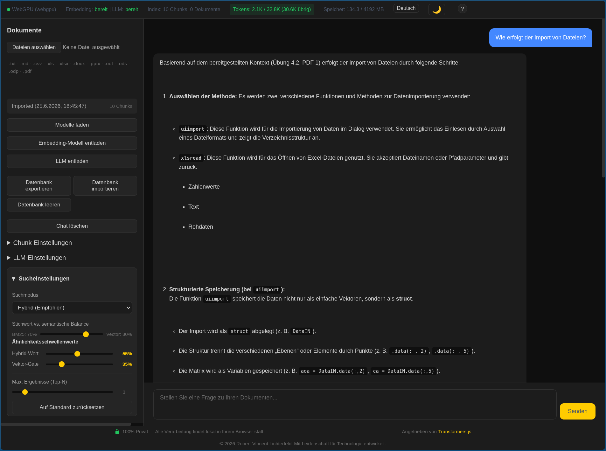
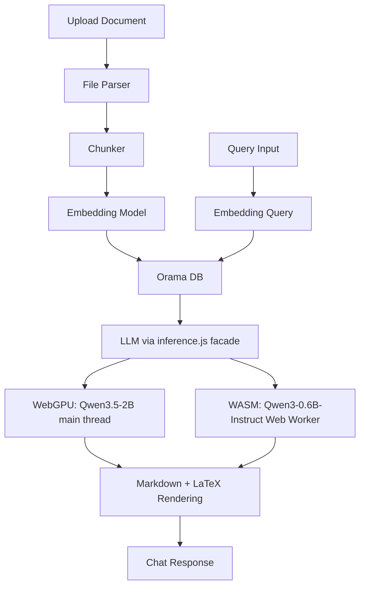

# RAG-Browser

A fully client-side, browser-based **Retrieval-Augmented Generation (RAG)** agent. Upload documents (`.txt`, `.md`, `.csv`, `.xls`, `.xlsx`, `.docx`, `.pptx`, `.odt`, `.ods`, `.odp`, `.pdf`), embed them locally, and query them conversationally — all without a server, API keys, or cloud infrastructure.



---

## Overview

RAG-Browser runs the entire AI pipeline inside your browser. Automatic hardware detection selects the optimal inference backend and model for your device:

| Backend | Device | LLM Model | Context Window | Thinking Mode |
|---------|--------|-----------|----------------|---------------|
| **WebGPU** | GPU | `Qwen3.5-2B` (q4, ~2.5 GB) | 32,768 tokens | ✅ Native (chat template) |
| **WASM** | CPU | `Qwen3-0.6B-Instruct` (q4, ~0.6 GB) | 4,096 tokens | ✅ Via prompt suffix (`/think`) |

- **Embedding** — `Qwen3-Embedding-0.6B` with instruction-aware queries, `last_token` pooling, and L2 normalization (1024-dim vectors)
- **Vector Search** — [Orama](https://www.jsdelivr.com/package/npm/@orama/orama) provides in-memory vector storage and retrieval, with configurable BM25/semantic hybrid search modes
- **Inference Runtime** — [Transformers.js v4](https://huggingface.co/docs/transformers.js) (ONNX on WebGPU / WASM)
- **WASM Worker** — CPU inference runs in a dedicated Web Worker to keep the UI responsive; SIMD and multi-threaded WASM (via `SharedArrayBuffer`) accelerate generation

The server serves only static files. **No user data ever leaves your device.**

## Architecture



### Inference Facade

The `inference.js` module abstracts the backend selection:

- **WebGPU path** — Delegates to `embedding.js` + `llm.js` on the main thread
- **WASM path** — Routes to `wasmWorkerProxy.js` which communicates with `wasmWorker.js` (a Web Worker running Transformers.js pipelines)

All consumers import from this single module; the facade routes calls transparently.

## Key Features

- **Multi-Format Ingestion** — Supports `.txt`, `.md`, `.csv`, `.xls`, `.xlsx`, `.docx`, `.pptx`, `.odt`, `.ods`, `.odp`, `.pdf`. Markdown syntax is stripped before embedding for cleaner vector representations. Legacy binary formats (`.doc`, `.ppt`) are unsupported and skipped with a user notification
- **100% Client-Side** — No backend, no API calls, no cloud dependencies
- **Privacy-First** — All processing happens locally; nothing leaves your device
- **Automatic Hardware Detection** — Detects WebGPU availability and selects the optimal model: `Qwen3.5-2B` (WebGPU) or `Qwen3-0.6B-Instruct` (WASM CPU fallback)
- **WASM Worker Isolation** — CPU inference runs in a dedicated Web Worker with SIMD enabled and multi-threaded WASM (up to 8 cores via `SharedArrayBuffer`), keeping the UI fully responsive
- **WASM Warm-Up** — A cold-start warm-up pass JIT-compiles WASM kernels on model load, eliminating latency on the first real query
- **Offline Support** — Service worker caches static assets for offline use
- **IndexedDB Persistence** — Document index survives page reloads
- **Database Portability** — Export and import document indexes as versioned JSON files with backward-compatible import (v1 raw Orama, v2 save/load format)
- **Hybrid Search (BM25 + Semantic)** — Configurable keyword vs. semantic balance (default 70/30) with separate similarity thresholds for hybrid and vector-only modes, plus a vector quality gate to filter low-relevance hits
- **Search Mode Toggle** — Switch between Hybrid and Vector-only search modes
- **Thinking Mode** — Enable reasoning mode on both backends. WebGPU uses native chat template (`enable_thinking`); WASM uses `/think` prompt suffix. Thinking output renders as collapsible `<details>` blocks on both backends
- **Adjustable Thinking Budget** — Control the maximum tokens allocated to the model's internal reasoning (1024–8192, default 4096) when thinking mode is active
- **Markdown & LaTeX Rendering** — LLM responses render formatted markdown (via `marked`) and LaTeX math expressions (via KaTeX 0.17.0)
- **Multi-turn Conversations** — Context-aware dialogue with up to 10 recent messages (5 exchanges) included in context
- **Model Lifecycle Control** — Independent load/unload controls for embedding model and LLM to manage memory
- **Token Usage Tracking** — Real-time context window consumption with five warning levels: OK (≤75%), Caution (>75%), Warning (>90%), Critical (>95%), Exceeded (full). Color-coded indicator with a banner and one-click "Clear Chat" when context is nearly full
- **Generation Parameters** — Configurable temperature, top-p, top-k, min-p, presence penalty, and repetition penalty with auto-applied presets for thinking vs. non-thinking modes
- **Internationalization (i18n)** — Full UI localization in English, German, Italian, Spanish, and French. Browser language auto-detected on first visit; language switcher persisted in `localStorage`
- **Help & About Modal** — Click the "?" button in the status bar to open a help panel with architecture overview, model storage and cache management instructions, and step-by-step WebGPU enablement guides for all major browsers
- **Dark Mode** — Toggle between light and dark themes via the theme button in the status bar. Theme preference is persisted in `localStorage`
- **Memory Monitoring** — Real-time memory usage displayed in the status bar, showing consumed memory and total device memory when available

## Technology Stack

| Component              | Technology                                       |
|------------------------|---------------------------------------------------|
| Embedding Model        | Qwen3-Embedding-0.6B (ONNX, 1024-dim vectors)    |
| LLM (WebGPU)           | Qwen3.5-2B (ONNX, q4 quantized)                  |
| LLM (WASM fallback)    | Qwen3-0.6B-Instruct (ONNX, q4 quantized)         |
| Inference Runtime      | Transformers.js v4.2.0                            |
| Vector Database        | Orama v3.1.18                                     |
| Document Parser        | officeParser 7.2.0 (CDN, lazy-loaded)             |
| PDF Parser             | PDF.js 4.9.155 (Mozilla, CDN, lazy-loaded)       |
| Markdown Rendering     | marked (CDN)                                      |
| LaTeX Rendering        | KaTeX 0.17.0 (CDN)                               |
| Acceleration           | WebGPU + SIMD + multi-threaded WASM              |
| Persistence            | IndexedDB                                         |
| Offline                | Service Worker + CDN caching                      |

## Project Structure

```
rag-v2-qwen3.6-27b/
├── index.html           # Main application shell
├── sw.js                # Service worker (offline caching)
├── favicon.svg          # Favicon
├── package.json         # ES module flag
├── server.js            # Dev server with COOP/COEP headers
├── css/
│   └── styles.css       # Application styling
├── js/
│   ├── app.js           # Application entry point & orchestration
│   ├── hardware.js      # WebGPU detection & hardware capabilities
│   ├── state.js         # Centralized application state (pub/sub)
│   ├── i18n.js          # Internationalization (5 languages)
│   ├── inference.js     # Unified inference facade (WASM vs WebGPU routing)
│   ├── embedding.js     # Embedding model loading & inference (WebGPU)
│   ├── llm.js           # LLM loading, generation & disposal (WebGPU)
│   ├── wasmWorker.js    # Web Worker for WASM inference (embedding + LLM)
│   ├── wasmWorkerProxy.js # Promise-based proxy wrapping wasmWorker.js
│   ├── chunker.js       # Document chunking with paragraph awareness
│   ├── fileParser.js    # Multi-format file parsing (officeParser + PDF.js)
│   ├── orama-db.js      # Orama vector DB + IndexedDB persistence
│   ├── rag-pipeline.js  # Ingestion, retrieval & generation pipeline
│   ├── renderer.js      # Markdown + LaTeX rendering for chat messages
│   ├── ui.js            # DOM rendering & general UI updates
│   └── utils.js         # Helpers (UUID, token estimation, formatting)
├── examples/                    # Minimal test pages for individual models
├── debug_data/                  # Debug screenshots and diagnostics
├── PRD.md                       # Product Requirements Document
└── IMPLEMENTATION_PLAN.md       # Detailed implementation plan
```

## Module Responsibilities

| Module               | Responsibility                                           |
|----------------------|----------------------------------------------------------|
| `hardware.js`        | Detect WebGPU, device memory, select backend and model   |
| `state.js`           | Central state management with pub/sub; token tracking;   |
|                      | search and LLM configuration with generation presets     |
| `i18n.js`            | Internationalization (en, de, it, es, fr);               |
|                      | browser language detection, localStorage persistence     |
| `inference.js`       | Unified facade routing embedding/LLM calls to WASM       |
|                      | (Web Worker) or WebGPU (main thread) backends            |
| `embedding.js`       | Load/unload embedding model, generate embeddings (WebGPU)|
| `llm.js`             | Load/unload LLM, batch-decode generation (WebGPU);       |
|                      | reports exact output token count                         |
| `wasmWorker.js`      | Web Worker running Transformers.js pipelines;            |
|                      | SIMD + multi-threaded WASM; warm-up pass on load         |
| `wasmWorkerProxy.js` | Promise-based proxy wrapping wasmWorker.js;              |
|                      | exposes same API as embedding.js + llm.js                |
| `chunker.js`         | Paragraph-aware chunking with sentence-level fallback    |
| `fileParser.js`      | Parse multi-format documents; lazy-load officeParser     |
|                      | and PDF.js from CDN; strip markdown syntax from .md files|
| `orama-db.js`        | Create DB, insert chunks, vector/hybrid search,          |
|                      | IndexedDB persistence, versioned export/import           |
| `rag-pipeline.js`    | Orchestrate ingestion → embedding → retrieval;           |
|                      | estimates input tokens and updates tracking              |
| `renderer.js`        | Markdown rendering (marked), LaTeX rendering (KaTeX),    |
|                      | collapsible thinking blocks                              |
| `ui.js`              | DOM rendering & general UI updates                       |
| `app.js`             | Wire everything together; event handlers                 |
| `utils.js`           | Shared utilities; token estimation with chat template    |
|                      | overhead; warning level logic                            |

## Getting Started

### Prerequisites

- A modern browser with **WebGPU support** (Chrome 113+, Edge 113+, or Chromium-based browsers)
- A local HTTP server (browsers block some features when opening files directly via `file://`)

### Quick Start

**Recommended** — Use the bundled dev server to enable multi-threaded WASM:

```bash
node server.js
```

Then open `http://localhost:3000`. This server sets the required **COOP/COEP headers** that unlock `SharedArrayBuffer`, enabling multi-threaded WASM inference (2–4× faster CPU generation).

**Without COOP/COEP headers**, the browser blocks `SharedArrayBuffer` and ONNX Runtime falls back to single-threaded WASM, which is **3–4× slower**.

**Alternative servers** (single-threaded WASM, no COOP/COEP):

```bash
npx serve .
python3 -m http.server 8080
npx http-server .
```

> **Note:** Standard tools like `npx serve`, `python3 -m http.server`, and `npx http-server` do **not** set COOP/COEP headers. They work fine for WebGPU inference, but WASM will run single-threaded. Use `node server.js` for optimal WASM performance.

### Usage

1. **Load Models** — Click "Load Models" to download and initialize the embedding model and LLM. The app auto-selects Qwen3.5-2B (WebGPU) or Qwen3-0.6B-Instruct (WASM) based on hardware detection
2. **Upload Documents** — Select files (`.txt`, `.md`, `.csv`, `.xls`, `.xlsx`, `.docx`, `.pptx`, `.odt`, `.ods`, `.odp`, `.pdf`) via the file input (supports multiple uploads)
3. **Configure Search** — Use the Search Settings panel in the sidebar to adjust BM25/semantic weights, similarity thresholds, and top-N results
4. **Toggle Thinking Mode** — Use the LLM Settings panel to enable reasoning mode. When on, the model outputs a collapsible thinking block before its answer. Use the "Max Thinking Tokens" slider to control the reasoning budget (1024–8192 tokens, default 4096)
5. **Adjust Generation** — Fine-tune temperature, top-p, top-k, min-p, presence penalty, and repetition penalty. Click "Reset to Preset" to restore the recommended settings for your current thinking mode
6. **Ask Questions** — Type a query in the chat panel and press Send
7. **Monitor Token Usage** — The status bar shows real-time context window consumption. When tokens run low, a color-coded indicator warns you and a banner offers a one-click "Clear Chat" to reset the context
8. **Change Language** — Select your preferred UI language from the language switcher (English, German, Italian, Spanish, French)
9. **Manage Indexes** — Export your document index as JSON or import an existing index
10. **Control Memory** — Unload individual models (embedding or LLM) independently via sidebar controls
11. **Stop Generation** — Click "Stop" to cancel a running response
12. **Clear Chat** — Reset the conversation and token usage from the sidebar or the warning banner

## System Requirements

| Resource        | WebGPU (Recommended)      | WASM (Fallback)         |
|-----------------|---------------------------|-------------------------|
| Device Memory   | 8 GB RAM                  | 6 GB RAM                |
| GPU             | WebGPU capable             | Not required            |
| Browser         | Chrome 113+, Edge 113+    | Any modern browser      |
| Model Download  | ~2.5 GB (Qwen3.5-2B q4)   | ~0.6 GB (Qwen3-0.6B q4) |

### Inference Performance

| Backend | Speed | Context | Notes |
|---------|-------|---------|-------|
| WebGPU (Qwen3.5-2B) | Fast | 32K tokens | GPU-accelerated; native thinking mode |
| WASM multi-threaded | Moderate | 4K tokens | Requires COOP/COEP headers; SIMD + up to 8 cores; supports thinking mode |
| WASM single-threaded | Slow | 4K tokens | Fallback when SharedArrayBuffer unavailable; 3–4× slower; supports thinking mode |

## Privacy & Security

- All inference runs locally in your browser
- No data is transmitted to any external server
- Document embeddings and conversation history are stored only in your browser's IndexedDB
- Models are loaded from Hugging Face via the jsDelivr CDN
- Database export/import allows local backups without any network transfer

## Development

### Documentation

- **`docs/DEVELOPER.md`** — Comprehensive developer guide: architecture deep-dive, module API reference, data flow diagrams, configuration, debugging, extension points, and testing
- **`PRD.md`** — Full product requirements, data models, and acceptance criteria
- **`IMPLEMENTATION_PLAN.md`** — Detailed 5-phase implementation plan with API patterns and validation criteria

### Generation Presets

Generation parameters follow official Qwen3.5 recommendations:

| Parameter | Non-Thinking | Thinking |
|-----------|-------------|----------|
| Temperature | 0.7 | 1.0 |
| top_p | 0.8 | 0.95 |
| top_k | 20 | 20 |
| min_p | 0.0 | 0.0 |
| presence_penalty | 1.5 | 1.5 |
| repetition_penalty | 1.0 | 1.0 |
| max_new_tokens | 8192 | 8192 |

The preset is auto-applied when toggling thinking mode. For WASM, `max_new_tokens` is capped at 2048, and `min_p` / `presence_penalty` are not supported (pipeline API limitation).

### Embedding Strategy

- **Query embeddings** wrap the user's query with an instruction prefix: `Instruct: {task}\nQuery:{query}`
- **Document embeddings** are generated without instruction wrapping
- Both use `last_token` pooling with L2 normalization (1024-dimensional vectors)
- Documents are embedded in batches of 32 chunks for efficiency
- **Embedding dtype** — WebGPU uses `fp16` for higher quality; WASM uses `q8` for compatibility and smaller model size

### Search Configuration Defaults

| Setting | Value | Description |
|---------|-------|-------------|
| Mode | `hybrid` | Combines BM25 keyword matching with vector similarity |
| BM25 weight | 0.7 | Keyword matching weight |
| Vector weight | 0.3 | Semantic similarity weight |
| Hybrid threshold | 0.65 | Minimum combined score |
| Min vector gate | 0.55 | Vector quality gate in hybrid mode |
| Vector threshold | 0.7 | Pure vector similarity threshold |
| Top-N | 5 | Max chunks retrieved per query (1–20) |

### Token Tracking Levels

| Level | Usage | UI Behavior |
|-------|-------|-------------|
| OK | ≤75% | Normal status indicator |
| Caution | >75% | Gentle suggestion to clear chat |
| Warning | >90% | Stronger warning message |
| Critical | >95% | Urgent warning banner |
| Exceeded | >100% | Context full; generation blocked |

### Browser Compatibility

| Browser        | Status   | Notes                          |
|----------------|----------|--------------------------------|
| Chrome 113+    | ✅ Full  | WebGPU enabled by default      |
| Edge 113+      | ✅ Full  | WebGPU enabled by default      |
| Firefox 141+   | ✅ Full  | WebGPU enabled by default (Windows). 145+ for macOS (Apple Silicon) |
| Firefox (Linux/Android) | ⚠️ In Progress | Support expected in 2026 |
| Safari 26+     | ✅ Full  | WebGPU enabled by default (macOS Tahoe 26, iOS 26) |
| Safari < 26    | ⚠️ WASM  | WebGPU not available; WASM fallback |
| Opera 99+      | ✅ Full  | Chromium-based, WebGPU enabled |

## Intended Use

RAG-Browser is designed as a **personal, privacy-first tool** for querying a small to medium
collection of documents locally in your browser. It is best suited for:

- **Personal knowledge management** — Searching through your own notes, articles, or research papers.
- **Lightweight document Q&A** — Asking questions about a handful of uploaded documents without sending data to any cloud service.
- **Prototyping and experimentation** — Evaluating RAG workflows entirely client-side before committing to a server-based solution.

### Limitations

Because the entire AI pipeline runs inside a web browser, the application is subject to the
following constraints:

- **Document size** — Only medium-sized documents are practical. Very large files (hundreds of pages or more) may cause slow parsing, high memory usage, or browser crashes.
- **Document volume** — The application works best with a modest number of documents. Indexing many large files simultaneously can exhaust browser memory.
- **Performance** — Inference speed depends on your device and browser. Without WebGPU acceleration, generation can be 10–50× slower. Even with WebGPU, throughput is lower than a dedicated server or native application.
- **Memory constraints** — The browser sandbox limits available memory. Models and document embeddings reside in-process and may be evicted or cause tab instability under heavy load.
- **No long-running background tasks** — Closing or refreshing the tab interrupts any in-progress generation or ingestion.
- **WASM output cap** — The WASM backend caps generation at 2048 tokens to prevent excessively long waits (at 2–5 tok/s, 2048 tokens ≈ 7–18 minutes worst-case).
- **WASM generation parameters** — The WASM pipeline doesn't support `min_p` and `presence_penalty`. Only `temperature`, `top_p`, `top_k`, and `repetition_penalty` are available on the WASM backend.
- **No streaming** — Both backends generate the full response then return it at once (WebGPU uses batch decode to avoid incremental BPE decoding bugs). The response is not token-streamed.

RAG-Browser is **not intended** for enterprise-scale document retrieval, high-throughput production workloads, or scenarios where consistent response times are critical.

## License

This project is provided as-is for personal and research use.

### Models

This application incorporates the following models, licensed under the Apache License 2.0:

- **Qwen3-Embedding-0.6B-ONNX** — [onnx-community/Qwen3-Embedding-0.6B-ONNX](https://huggingface.co/onnx-community/Qwen3-Embedding-0.6B-ONNX)
  Licensed under the [Apache License 2.0](https://www.apache.org/licenses/LICENSE-2.0).
- **Qwen3.5-2B-ONNX** — [huggingworld/Qwen3.5-2B-ONNX](https://huggingface.co/huggingworld/Qwen3.5-2B-ONNX) (derived from [Qwen/Qwen3.5-2B-Base](https://huggingface.co/Qwen/Qwen3.5-2B-Base))
  Licensed under the [Apache License 2.0](https://www.apache.org/licenses/LICENSE-2.0).
- **Qwen3-0.6B-Instruct-ONNX** — [onnx-community/Qwen3-0.6B-Instruct-ONNX](https://huggingface.co/onnx-community/Qwen3-0.6B-Instruct-ONNX)
  Licensed under the [Apache License 2.0](https://www.apache.org/licenses/LICENSE-2.0).

### Search engine and RAG pipeline

This application incorporates the following search engine and RAG pipeline, licensed under the Apache License 2.0:

- **Orama** — [https://github.com/oramasearch/orama](https://github.com/oramasearch/orama/) Licensed under the [Apache License 2.0](https://www.apache.org/licenses/LICENSE-2.0).
