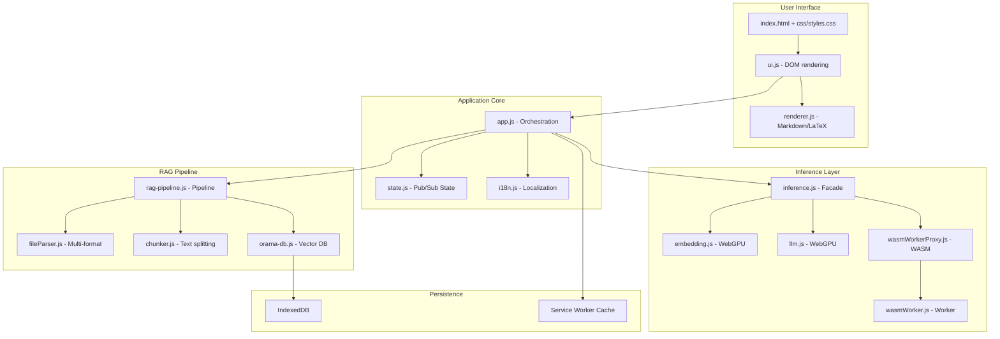
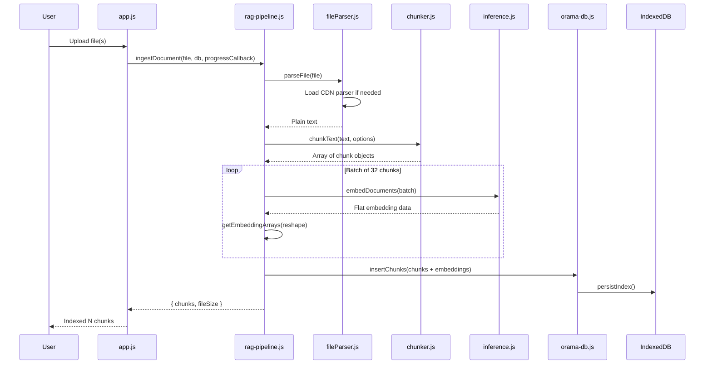
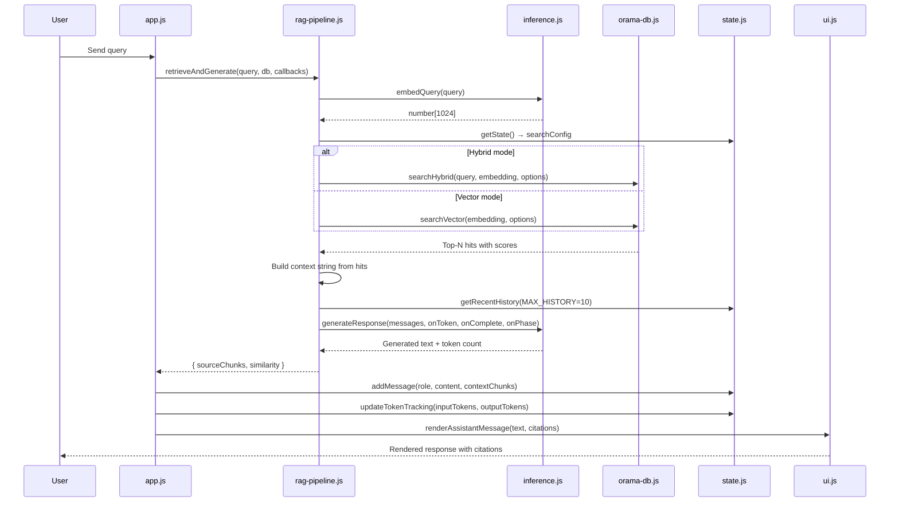
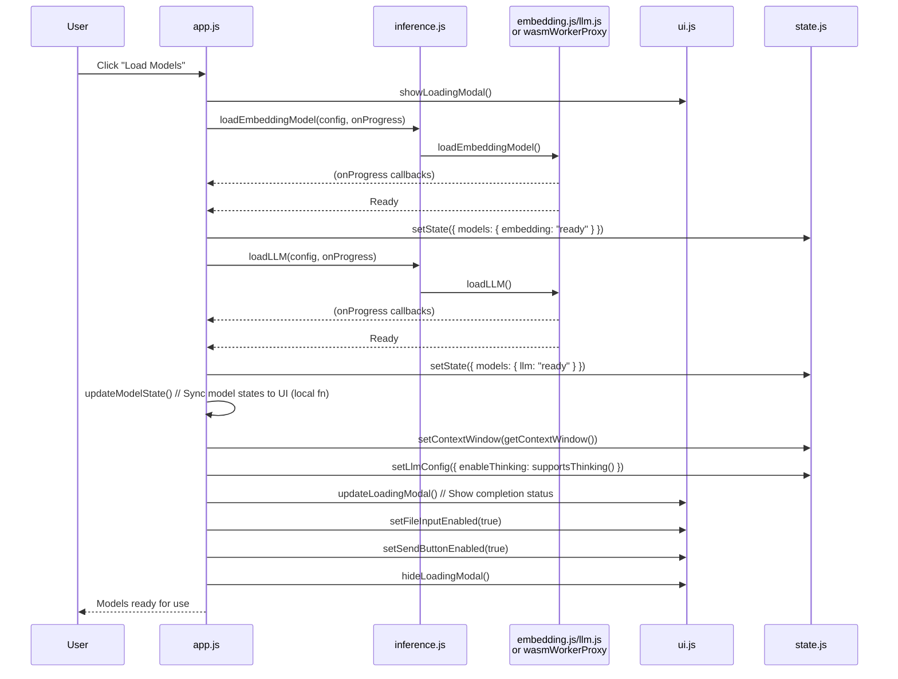
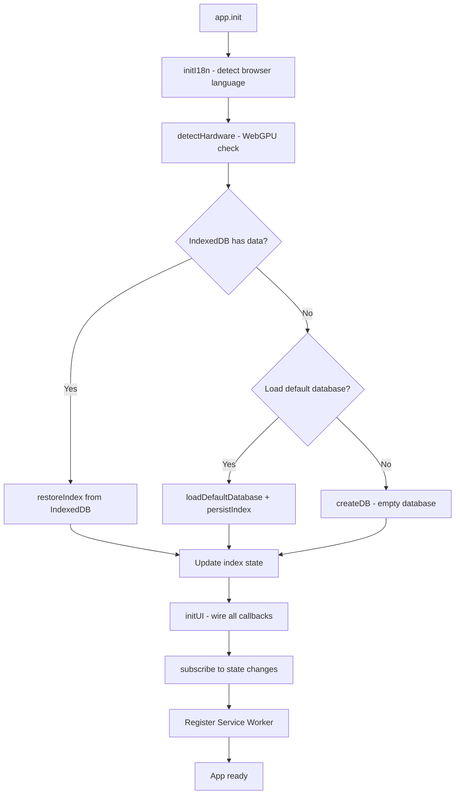
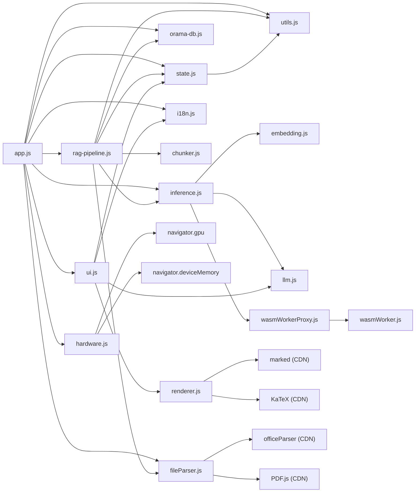

# RAG-Browser Developer Guide

This document is for developers who want to understand, modify, or extend RAG-Browser. It covers the internal architecture, module APIs, data flow, configuration, debugging, testing, and extension points.

**For end-users, see [README.md](../README.md). For project requirements, see [PRD.md](../PRD.md). For build planning, see [IMPLEMENTATION_PLAN.md](../IMPLEMENTATION_PLAN.md).**

---

## Table of Contents

1. [Development Setup](#1-development-setup)
2. [Architecture Deep-Dive](#2-architecture-deep-dive)
3. [Module API Reference](#3-module-api-reference)
4. [Data Flow](#4-data-flow)
5. [Configuration Reference](#5-configuration-reference)
6. [Debugging Guide](#6-debugging-guide)
7. [Extension Points](#7-extension-points)
8. [Testing Guide](#8-testing-guide)
9. [Performance Considerations](#9-performance-considerations)
10. [Service Worker](#10-service-worker)
11. [Internationalization](#11-internationalization)
12. [CSS Architecture](#12-css-architecture)
- [Appendix A: File Dependencies](#appendix-a-file-dependencies)
- [Appendix B: CDN Dependencies](#appendix-b-cdn-dependencies)

---

## 1. Development Setup

### 1.1 Prerequisites

- **Node.js 18+** — Required for the dev server (`node server.js`)
- **ES Module Support** — `package.json` sets `"type": "module"`
- **Modern Browser** — Chrome 113+, Edge 113+, or Firefox 129+ for full functionality

### 1.2 Starting the Dev Server

```bash
cd rag-v2-qwen3.6-27b
node server.js              # Starts on port 3000
PORT=8080 node server.js    # Custom port
```

The server is required for:
1. **COOP/COEP headers** — Enable `SharedArrayBuffer` for multi-threaded WASM
2. **Cross-origin isolation** — Without this, WASM falls back to single-threaded (3-4x slower)
3. **ES Module serving** — Proper MIME types for `.js` and `.mjs` files

**Do not open `index.html` directly via `file://`** — this will disable multi-threaded WASM and cause SharedArrayBuffer errors.

### 1.3 Project Structure

```
rag-v2-qwen3.6-27b/
├── index.html              # Main application shell
├── server.js               # Dev server with COOP/COEP headers
├── sw.js                   # Service worker (offline caching)
├── favicon.svg             # Favicon
├── package.json            # ES module flag, npm scripts
├── .gitignore              # Git exclusions
├── run-tests.sh            # All-in-one test runner (coverage + reports)
├── serve-coverage.sh       # Coverage server launcher with port checking
├── cypress.config.js       # Cypress configuration
├── docs/                   # Developer documentation
│   └── DEVELOPER.md        # This file
├── css/
│   └── styles.css          # Application styling
├── js/
│   ├── app.js              # Entry point & orchestration
│   ├── hardware.js         # WebGPU detection & hardware config
│   ├── state.js            # Centralized state (pub/sub)
│   ├── i18n.js             # Internationalization (5 languages)
│   ├── inference.js        # Unified inference facade
│   ├── embedding.js        # Embedding model (WebGPU/main thread)
│   ├── llm.js              # LLM loading & generation (WebGPU/main thread)
│   ├── wasmWorker.js       # Web Worker for WASM inference
│   ├── wasmWorkerProxy.js  # Promise-based proxy for wasmWorker.js
│   ├── chunker.js          # Document chunking
│   ├── fileParser.js       # Multi-format file parsing
│   ├── orama-db.js         # Orama vector DB + IndexedDB persistence
│   ├── rag-pipeline.js     # Ingestion, retrieval & generation
│   ├── renderer.js         # Markdown + LaTeX rendering
│   ├── ui.js               # DOM rendering & UI updates
│   ├── tour.js             # Onboarding tour (driver.js)
│   └── utils.js            # Shared utilities
├── cypress/                # E2E test suite
│   ├── README.md           # E2E test user guide
│   ├── e2e/                # Spec files (45 tests)
│   ├── support/            # Custom commands and global setup
│   └── fixtures/           # Test data files
├── examples/               # Minimal test pages for models
└── implementation/         # Implementation plan
    └── IMPLEMENTATION_PLAN.md
```

---

## 2. Architecture Deep-Dive

### 2.1 High-Level Design



### 2.2 Dual Backend Architecture

The application supports two inference backends, automatically selected based on hardware:

| Feature | WebGPU (Primary) | WASM (Fallback) |
|---------|-----------------|-----------------|
| Device | GPU | CPU |
| LLM Model | Qwen3.5-2B (q4, ~2.5 GB) | Qwen3-0.6B-Instruct (q4, ~0.6 GB) |
| Embedding Dtype | fp16 | q8 |
| Context Window | 32,768 tokens | 4,096 tokens |
| Performance | ~10-30 tok/s | ~2-5 tok/s |
| Threading | GPU compute | SIMD + SharedArrayBuffer (up to 8 threads) |
| Worker | N/A (main thread) | Dedicated Web Worker |

The `inference.js` facade transparently routes all calls to the correct backend. All other modules import from this single interface.

### 2.3 State Management

The application uses a centralized publish/subscribe pattern (`state.js`). The state is a single flat object that is shallow-merged on updates. All subscribers receive the full state on every change.

```javascript
let state = {
  hardware: {
    webgpuAvailable: false,
    device: "wasm",               // 'webgpu' | 'wasm'
    llmModelId: "",                // HuggingFace model ID
    dtype: "",                     // Legacy placeholder (unused)
    deviceMemoryGB: undefined,
  },
  models: { embedding: "unloaded", llm: "unloaded" },  // 'unloaded' | 'loading' | 'ready'
  index: { totalChunks: 0, totalDocuments: 0, embeddingDimension: 1024 },
  conversation: [],
  searchConfig: { mode, hybridWeights, thresholds, topN },
  llmConfig: { enableThinking, maxThinkingTokens, generation: { ... } },
  tokenTracking: { contextWindow, inputTokens, outputTokens, totalTokens, remainingTokens, warningLevel },
};
```

**Key design decision:** State is shallow-merged. Nested objects (e.g., `searchConfig`, `llmConfig`) have dedicated setter functions (`setSearchConfig()`, `setLlmConfig()`) that handle deep merging correctly.

### 2.4 Inference Facade

`inference.js` is the single entry point for all model operations. It lazy-loads backends and tracks readiness at the facade level.

```javascript
// All consumers import from here:
import {
  loadEmbeddingModel,    // Routes to embedding.js (WebGPU) or wasmWorkerProxy (WASM)
  unloadEmbeddingModel,
  isEmbeddingLoaded,     // Synchronous check
  embedQuery,            // Embed single query with instruction wrapping
  embedDocuments,        // Batch embed multiple texts
  getEmbeddingArrays,    // Reshape flat batch data to individual vectors
  loadLLM,               // Routes to llm.js (WebGPU) or wasmWorkerProxy (WASM)
  unloadLLM,
  isLLMLoaded,           // Synchronous check
  generateResponse,      // Generate with streaming callbacks
  stopGeneration,        // Interrupt current generation
  getContextWindow,      // Get model's context window
  supportsThinking,      // Check if model supports thinking mode
} from "./inference.js";
```

**Facade-level readiness tracking:** Because backends are lazy-loaded, `isEmbeddingLoaded()` and `isLLMLoaded()` must work even before the backend module is imported. The facade tracks `_embeddingReady` and `_llmReady` flags that are updated on every load/unload operation.

### 2.5 WASM Worker Architecture

WASM inference runs in a dedicated Web Worker (`wasmWorker.js`) to keep the UI responsive during CPU-bound computation.

**Communication pattern:** Promise-based message passing via `wasmWorkerProxy.js`:

```
Main Thread → wasmWorkerProxy.js → postMessage() → wasmWorker.js
                                         ← onmessage() ←
Main Thread ← resolve/reject Promise ←
```

**Key features:**
- SIMD enabled for 2-4x performance boost
- Multi-threading via SharedArrayBuffer (up to 8 cores, capped at 8)
- Warm-up pass on model load to JIT-compile WASM kernels
- Progress callbacks forwarded from worker to main thread
- Timeout handling (120s default, 5min for model load, 40min for generation)

### 2.6 Orama Vector Database

Orama (v3.1.18) provides in-memory vector storage and retrieval. The database schema stores:

```javascript
{
  content: "string",                    // Text chunk content
  embedding: "vector[1024]",           // 1024-dim embedding vector
  metadata: {
    sourceFile: "string",              // Original filename
    chunkIndex: "number",              // Sequential index within file
    charOffset: "number",              // Character offset in original text
    charLength: "number",              // Chunk length in characters
  },
}
```

**Persistence:** The index is serialized to IndexedDB after every ingestion operation. On app start, the index is restored from IndexedDB before any UI is shown.

**Export/Import:** Databases can be exported as versioned JSON files (`rag-browser-db-YYYYMMDD-HHmmss-Nchunks.json`). Import validates the schema and supports backward-compatible formats (v1 raw Orama, v2 save/load format).

---

## 3. Module API Reference

### 3.1 hardware.js

Detect hardware capabilities and return optimal runtime configuration.

```javascript
import { detectHardware } from "./hardware.js";

// Returns:
{
  webgpuAvailable: boolean,
  deviceMemoryGB: number | undefined,
  device: "webgpu" | "wasm",
  llmModelId: string,           // HuggingFace model ID
  embeddingDtype: "fp16" | "q8",
  llmDtype: "q4" | { embed_tokens: "q4", vision_encoder: "q4", decoder_model_merged: "q4" },
}
```

**Model selection:**
- WebGPU → `huggingworld/Qwen3.5-2B-ONNX` (multimodal, requires GatherBlockQuantized)
- WASM → `onnx-community/Qwen3-0.6B-Instruct-ONNX` (text-only, WASM-compatible q4)

### 3.2 state.js

Central application state with pub/sub pattern.

```javascript
import {
  getState,              // Get shallow copy of state
  setState,              // Shallow merge updates
  subscribe,             // Subscribe to state changes → returns unsubscribe fn
  addMessage,            // Add message to conversation history
  clearConversation,     // Clear all messages
  getRecentHistory,      // Get last N messages formatted for LLM
  setSearchConfig,       // Deep-merge search config updates
  resetSearchConfig,     // Reset search config to defaults
  setLlmConfig,          // Deep-merge LLM config updates
  resetLlmConfig,        // Reset LLM config to defaults
  resetGenerationToPreset, // Reset generation params to current preset
  updateTokenTracking,   // Update token counts and warning level
  getTokenTracking,      // Get current token tracking state
  resetTokenTracking,    // Reset token tracking
  setContextWindow,      // Set context window size
  getGenerationPreset,   // Get generation preset for thinking mode
} from "./state.js";
```

### 3.3 inference.js

Unified inference facade. See [Section 2.4](#24-inference-facade) for details.

### 3.4 embedding.js

Embedding model operations (WebGPU/main thread path).

```javascript
import {
  loadEmbeddingModel,     // Load Qwen3-Embedding-0.6B-ONNX
  unloadEmbeddingModel,   // Dispose model, free memory
  isEmbeddingLoaded,      // Check if model is loaded
  embedQuery,             // Embed single query (with instruction wrapping)
  embedDocuments,         // Batch embed multiple texts (no instruction)
  getEmbeddingArrays,     // Reshape flat batch data
} from "./embedding.js";
```

**Instruction wrapping:** Queries are wrapped with `"Instruct: {task}\nQuery:{query}"` where the task instruction is: `"Given a web search query, retrieve relevant passages that answer the query"`. Documents are embedded without instruction wrapping.

**Pooling:** Uses `last_token` pooling + L2 normalization. This works well with paragraph-aware chunking because the last token of a coherent paragraph captures better semantic meaning.

### 3.5 llm.js

LLM loading and generation (WebGPU/main thread path).

```javascript
import {
  loadLLM,               // Load Qwen3.5-2B or Qwen3-0.6B-Instruct
  unloadLLM,             // Dispose model, free memory
  isLLMLoaded,           // Check if model is loaded
  generateResponse,      // Generate with callbacks
  stopGeneration,        // Interrupt current generation
  getContextWindow,      // Get model's context window
  supportsThinking,      // Check thinking mode support
  WASM_MAX_NEW_TOKENS,   // 4096 (exported for UI constraints)
  WASM_MAX_THINKING_TOKENS, // 1024 (exported for UI constraints)
} from "./llm.js";
```

**Generation modes:**
- **Qwen3.5-2B (WebGPU):** Low-level API with `AutoProcessor` + `Qwen3_5ForConditionalGeneration`. Collects all tokens then batch-decodes (avoids TextStreamer incremental BPE bug). Thinking mode via chat template options (`enable_thinking`, `max_thinking_tokens`).
- **Qwen3-0.6B-Instruct (WASM):** Pipeline API with automatic tokenization and chat templating. Thinking mode via `/think` prompt suffix.

### 3.6 wasmWorker.js

Web Worker for WASM inference. Runs Transformers.js pipelines in a dedicated thread.

**Key configuration:**
```javascript
env.backends.onnx.wasm.simd = true;
env.backends.onnx.wasm.numThreads = Math.min(navigator.hardwareConcurrency || 4, 8);
```

**Message types:**
- `load-embedding` / `unload-embedding` — Model lifecycle
- `embed-query` / `embed-documents` — Embedding operations
- `load-llm` / `unload-llm` — Model lifecycle
- `generate` — Text generation
- `stop-generation` — Interrupt generation

**Progress forwarding:** Progress callbacks from Transformers.js are forwarded to the main thread via `postMessage({ type: "progress", tag, info })`.

### 3.7 wasmWorkerProxy.js

Promise-based proxy wrapping `wasmWorker.js`. Exposes the same API as `embedding.js` + `llm.js`.

**Timeout handling:** Defined inside `sendMessage()` with per-operation overrides:
```javascript
// Default timeout: 120s
// Per-operation overrides:
const TIMEOUTS = {
  "load-llm": 300_000,    // 5 min — q4 model downloads ~0.6GB
  "generate": 2400_000,   // 40 min — WASM q4 does ~2-5 tok/s
};
```

### 3.8 chunker.js

Paragraph-aware text chunking with sentence-level fallback.

```javascript
import { chunkText } from "./chunker.js";

const chunks = chunkText(text, {
  maxTokens: 512,           // Max tokens per chunk (default)
  overlapPercent: 12,       // Overlap percentage (default)
  sourceFile: "file.txt",   // Source filename for metadata
});

// Returns: Array of { id, content, metadata: { sourceFile, chunkIndex, charOffset, charLength } }
// Each chunk gets a unique id (UUID) for tracking and citation linking
```

**Strategy:**
1. Split by paragraphs (double newlines) — preserves semantic boundaries
2. Merge small paragraphs until chunk limit is reached
3. For oversized paragraphs, fall back to sentence-level splitting with overlap

### 3.9 fileParser.js

Multi-format document parsing.

```javascript
import {
  parseFile,               // Parse file → plain text
  isSupportedFormat,       // Check if format is supported
  needsOfficeParser,       // Check if officeParser CDN is needed
  needsPdfJs,             // Check if PDF.js CDN is needed
  loadOfficeParser,        // Load officeParser from CDN (lazy)
  SUPPORTED_EXTENSIONS,    // List of supported extensions
} from "./fileParser.js";
```

**Supported formats:** `.txt`, `.md`, `.csv`, `.xls`, `.xlsx`, `.docx`, `.pptx`, `.odt`, `.ods`, `.odp`, `.pdf`

**Parsing strategy:**
- `.txt` — Native `File.text()`
- `.md` — Native `File.text()` + markdown syntax stripping
- `.pdf` — PDF.js 4.9.155 (CDN, lazy-loaded)
- Office formats — officeParser 7.2.0 (CDN, lazy-loaded)

### 3.10 orama-db.js

Orama database operations with IndexedDB persistence.

```javascript
import {
  createDB,                // Create new Orama database
  insertChunks,            // Bulk-insert chunks with embeddings
  searchVector,            // Pure vector similarity search
  searchHybrid,            // BM25 + vector hybrid search
  getDocumentCount,        // Get total document count
  persistIndex,            // Save to IndexedDB
  restoreIndex,            // Load from IndexedDB
  loadDefaultDatabase,     // Load bundled default database
  serializeDB,             // Export to JSON blob
  generateExportFilename,  // Generate timestamped filename
  restoreFromData,         // Restore from serialized data
  validateImport,          // Validate imported database
} from "./orama-db.js";
```

**Hybrid search:** Combines BM25 keyword matching with vector similarity. After the hybrid search, a quality gate filters out results with vector similarity below the threshold (prevents keyword-only matches with low semantic relevance).

**IndexedDB format:** Uses `save()` from Orama to produce proper serializable state. Backward-compatible with old raw DB format.

**Key constants:**
```javascript
const DB_NAME = "rag-browser-db";
const DB_VERSION = 2;
const STORE_NAME = "documents";
const EXPORT_FORMAT = "rag-browser-orama";
const EXPORT_VERSION = 2;
const EXPECTED_DIMENSION = 1024;
```

### 3.11 rag-pipeline.js

RAG pipeline orchestration.

```javascript
import {
  ingestDocument,          // Parse → chunk → embed → index
  retrieveAndGenerate,     // Embed query → search → generate response
} from "./rag-pipeline.js";
```

**Ingestion steps:**
1. Parse file (load CDN parser if needed)
2. Chunk text with paragraph awareness
3. Generate embeddings in batches of 32
4. Insert into Orama database
5. Persist to IndexedDB

**Retrieval steps:**
1. Embed query (with instruction wrapper)
2. Search (hybrid or vector based on config)
3. Build context string from retrieved chunks
4. Build system prompt with context + conversation history
5. Generate response via LLM
6. Track token usage

**System prompts:**
- Non-thinking: Standard RAG prompt with context and question
- Thinking: Adds "Keep your reasoning brief and focused. Do not loop. Do NOT overthink."
- WASM fallback: Appends `/think` or `/no_think` suffix based on thinking toggle

### 3.12 renderer.js

Markdown and LaTeX rendering for chat messages.

```javascript
import {
  renderMarkdown,          // Render markdown → HTML
  renderLaTeX,             // Render LaTeX in DOM element
} from "./renderer.js";
```

**Processing pipeline:**
1. Preprocess `&lt;think&gt;` and `&lt;/think&gt;` tags → collapsible `<details>` elements
2. Render markdown with `marked` (GFM mode, breaks enabled)
3. Post-render LaTeX with KaTeX auto-render (`$$...$$` display, `$...$` inline)
4. Links opened in new tabs; `javascript:` URLs stripped for security

### 3.13 ui.js

DOM rendering, event handling, and UI state synchronization.

```javascript
import {
  initUI,                    // Wire all DOM event handlers
  updateStatusBar,           // Update status indicators
  updateWebGpuBanner,        // Show/hide WebGPU unavailable banner
  updateTokenStatus,         // Update token usage display
  updateTokenWarningBanner,  // Show/hide context window warning
  renderUserMessage,         // Add user message to chat
  renderAssistantMessage,    // Add assistant message + citations
  renderStreamingMessage,    // Render message with markdown/latex, thinking blocks, and phase updates
  updateProgress,            // Update ingestion progress bar
  updateDocumentList,        // Update sidebar document list
  showNotification,          // Show toast notification
  repositionErrorNotifications, // Reposition notifications after layout changes
  scrollConversation,        // Auto-scroll chat to bottom
  showLoadingModal,          // Show model loading modal
  hideLoadingModal,          // Hide loading modal
  updateLoadingModal,        // Update loading progress
  setFileInputEnabled,       // Enable/disable file upload
  setSendButtonEnabled,      // Enable/disable send button
  setUnloadButtonStates,     // Update unload button states
  syncSettingsUI,            // Sync search settings to UI controls
  syncLlmSettingsUI,         // Sync LLM settings to UI controls
  initSearchSettings,        // Initialize search settings panel (mode, thresholds, weights)
  initLlmSettings,           // Initialize LLM settings panel (thinking, gen params)
  initHelpModal,             // Initialize help modal with walkthrough
  initThemeToggle,           // Initialize dark/light theme toggle
  initLanguageSelector,      // Initialize language dropdown
  applyThemeEmoji,           // Apply emoji indicator for current theme
} from "./ui.js";
```

### 3.14 app.js

Main entry point and application orchestrator.

```javascript
import { init } from "./app.js";
init(); // Called from index.html <script type="module">
```

**Boot sequence:**
1. Initialize i18n (detect browser language, load from `localStorage`)
2. Detect hardware capabilities → `setState({ hardware })`
3. Restore persisted index from IndexedDB via `restoreIndex()`
4. If index is empty, attempt to load bundled default database
5. Update index stats in state
6. Initialize UI and wire all callbacks
7. Subscribe to state changes for status bar and model state updates
8. Register service worker (optional, silent failure)

**Key module-level state:**
```javascript
let db = null;                    // Orama database instance
const ingestedDocuments = [];     // Track ingested documents for sidebar
let isGenerating = false;         // Guard against concurrent generation
```

**Helper function:**
```javascript
getSelectedChunkSize()  // Read chunk size from UI dropdown (256/512/1024 tokens)
```

**Event handlers (wired via initUI callbacks):**
```javascript
handleFileUpload(files)            // Ingest uploaded files through RAG pipeline
handleQuery(query)                 // Run retrieval + generation pipeline
handleStop()                       // Stop current generation
handleLoadModels()                 // Load embedding → load LLM → enable UI
handleUnloadEmbedding()            // Unload embedding model
handleUnloadLLM()                  // Unload LLM model
handleClearChat()                  // Clear conversation + reset token tracking
handleClearDB()                    // Clear Orama DB + IndexedDB (with confirmation)
handleExportDB()                   // Export database to JSON file
handleImportDB(file)               // Import database from JSON (with validation)
handleResetSettings()              // Reset all settings to defaults
handleResetLlmSettings()           // Reset only LLM settings to defaults
getUIButtons()                     // Return references to send/stop/query elements
resetUIButtons()                   // Reset button states after generation
```

**Model lifecycle:**
- `handleLoadModels()`: Load embedding → load LLM → update context window → enable UI
- `handleUnloadEmbedding()`: Unload embedding → if LLM was loaded, reload it (may need to switch dtype)
- `handleUnloadLLM()`: Unload LLM → if embedding was loaded, reload it (may need to switch dtype)

When one model is unloaded, the other may need to be reloaded if its dtype depends on the hardware config that changed. This is the "cross-dependency" reload logic.

### 3.15 i18n.js

Internationalization system with 5 supported languages.

```javascript
import {
  initI18n,                          // Initialize (detect + load)
  t,                                 // Translate: t(key, { replacement })
  getLanguage,                       // Get current language code
  setLanguage,                       // Switch language (persisted to localStorage)
  getSupportedLanguages,             // Get list of { code, label, nativeLabel }
  registerLanguageChangeListener,    // Register callback for language changes
  applyStaticTranslations,           // Update DOM elements with data-i18n attributes
} from "./i18n.js";
```

**Languages:** English (`en`), German (`de`), Italian (`it`), Spanish (`es`), French (`fr`).

**Usage in HTML:**
```html
<button data-i18n="sidebar.btn.loadModels">Load Models</button>
```

Translation keys follow a dot-namespace pattern: `{category}.{subCategory}.{key}` (e.g., `settings.llm.temperature`, `notif.dbExported`).

### 3.16 utils.js

Shared utility functions.

```javascript
import {
  generateUUID,            // crypto.randomUUID() — requires secure context
  estimateTokens,          // text → ~tokens (4 chars/token heuristic)
  formatBytes,             // bytes → "1.5 MB"
  getNewText,              // Diff accumulated text (streaming delta)
  estimateInputTokens,     // Estimate tokens for message array (1.15x chat template overhead)
  formatTokens,            // Format with K/M suffix (e.g., "32.0K")
  getWarningLevel,         // Get warning level from usage percentage
  ensureThinkTags,         // Wrap thinking content with proper think tags
} from "./utils.js";
```

**Chat template overhead:** The `1.15` multiplier in `estimateInputTokens()` accounts for formatting tokens (role markers, separators, special tokens) added by `processor.apply_chat_template()`.

### 3.17 tour.js

Interactive onboarding tour using [driver.js](https://github.com/kamranahmedse/driver.js) (CDN, ES module import).

```javascript
import {
  initTour,                    // Initialize tour button click handler
  startTour,                   // Launch the guided tour
  hasCompletedTour,            // Check if user has completed the tour
  markTourCompleted,           // Mark tour as completed (persisted to localStorage)
} from "./tour.js";
```

**Tour steps (8 total):**
1. App container — Welcome message and privacy overview
2. Status bar — Hardware detection, model status, token usage, memory
3. Load Models — Embedding and LLM model loading
4. Upload Documents — Multi-format file upload
5. Document List — Indexed documents with chunk counts
6. Database Actions — Export, import, and clear database
7. Ask Questions — Query input and chat interface
8. Search Settings — BM25/semantic weights, thresholds, top-N

**Localization:** All step titles and descriptions are fully localized via `i18n.js` using `tour.step{N}.title` and `tour.step{N}.description` keys. Tour buttons (next, previous, done, close) are also localized.

**Persistence:** Completion is stored in `localStorage` (`rag-tour-completed: "1"`). The tour button (compass icon 🧭) is always available, but the tour remembers if the user has already completed it.

**Scroll behavior:** The tour auto-scrolls target elements into view and resets sidebar scroll position after each step to ensure elements are visible.

---

## 4. Data Flow

### 4.1 Ingestion Pipeline



### 4.2 Retrieval & Generation Pipeline



### 4.3 Model Loading Flow



### 4.4 Application Boot Sequence



---

## 5. Configuration Reference

### 5.1 Search Configuration

Managed via `state.js` → `setSearchConfig()`.

| Setting | Default | Range | Description |
|---------|---------|-------|-------------|
| `mode` | `"hybrid"` | `"hybrid"`, `"vector"` | Search algorithm |
| `hybridWeights.text` | `0.7` | `0.0–1.0` | BM25 keyword weight (hybrid only) |
| `hybridWeights.vector` | `0.3` | `0.0–1.0` | Vector similarity weight (hybrid only) |
| `thresholds.hybridSimilarity` | `0.55` | `0.0–1.0` | Minimum combined score (hybrid) |
| `thresholds.minVectorSimilarity` | `0.35` | `0.0–1.0` | Vector quality gate (hybrid post-filter) |
| `thresholds.vectorSimilarity` | `0.7` | `0.0–1.0` | Minimum cosine similarity (vector mode) |
| `topN` | `3` | `1–20` | Maximum chunks retrieved per query |

### 5.2 LLM Configuration

Managed via `state.js` → `setLlmConfig()`.

| Setting | Default | Range | Description |
|---------|---------|-------|-------------|
| `enableThinking` | `false` | `boolean` | Enable model reasoning mode |
| `maxThinkingTokens` | `4096` | `1024–8192` | Token budget for internal reasoning |

#### Generation Presets

Auto-applied when the thinking toggle changes. Individual parameters can be fine-tuned afterward.

| Parameter | Non-thinking | Thinking | Description |
|-----------|-------------|----------|-------------|
| `temperature` | 0.7 | 1.0 | Randomness of sampling |
| `top_p` | 0.8 | 0.95 | Nucleus sampling threshold |
| `top_k` | 20 | 20 | Top-K sampling limit |
| `min_p` | 0.0 | 0.0 | Minimum probability threshold |
| `presence_penalty` | 1.5 | 1.5 | Penalty for new tokens based on presence |
| `repetition_penalty` | 1.0 | 1.0 | Penalty for repeated tokens |
| `max_new_tokens` | 8192 | 8192 | Maximum output tokens |

### 5.3 Token Tracking

| Level | Threshold | Description |
|-------|-----------|-------------|
| `ok` | ≤ 75% usage | No warning banner |
| `caution` | > 75% | Gentle suggestion to clear chat |
| `warning` | > 90% | Stronger warning message |
| `critical` | > 95% | Urgent warning with one-click clear |
| `exceeded` | 100% | Context full — must clear chat |

### 5.4 WASM Limits

| Constant | Value | Reason |
|----------|-------|--------|
| `WASM_MAX_NEW_TOKENS` | 4096 | ~2-5 tok/s × 4096 = ~14-36 min worst-case |
| `WASM_MAX_THINKING_TOKENS` | 1024 | Fixed (pipeline API doesn't support dynamic limit) |
| `CONTEXT_WINDOW_WASM` | 4096 | Native Qwen3-0.6B context |
| `CONTEXT_WINDOW_WEBGPU` | 32768 | Practical browser limit for Qwen3.5-2B |

---

## 6. Debugging Guide

### 6.1 Browser Console

The application logs structured information:

**WASM worker initialization:**
```
[wasmWorker] SIMD: enabled | Threads: 8 | SharedArrayBuffer: true (multi-threaded WASM active)
```
If you see `single-threaded fallback`, COOP/COEP headers are missing.

**Retrieval debug groups:**
```
🔍 Retrieval [hybrid]: "What is the capital of France?"
  Hits: 3
  Config: threshold=0.65, topN=5
    [1] score=0.892 | The capital of France is Paris...
    [2] score=0.761 | Paris is the capital city of...
```
Expand these groups in the console for detailed retrieval diagnostics.

**Application boot:**
```
Index loaded: 1 documents
Default database loaded: 1 documents
RAG-Browser initialized.
```

### 6.2 IndexedDB Inspection

1. Open DevTools → **Application** tab
2. Navigate to **Storage → IndexedDB** → `rag-browser-db` → `documents` store
3. Two records: `orama-db` (serialized index blob), `metadata` (version info)
4. Right-click → Export to view raw JSON

### 6.3 Common Issues

#### SharedArrayBuffer not available

```
[wasmWorker] SIMD: enabled | Threads: 8 | SharedArrayBuffer: false (single-threaded fallback)
```

**Cause:** COOP/COEP headers not set (file:// protocol) or browser doesn't support cross-origin isolation.

**Fix:** Run `node server.js` instead of opening `index.html` directly.

#### WebGPU not detected

**Check:**
- Chrome/Edge: `chrome://gpu` → Verify WebGPU status is "Available"
- Firefox: Enable `dom.webgpu.enabled` in `about:config`
- Safari: Enable in `Develop → Experimental Features → WebGPU`
- Linux: May require `--enable-features=Vulkan` flag

The application falls back to WASM automatically if WebGPU is unavailable.

#### Model loading fails

**Check:**
- Network tab — all CDN requests should succeed (Transformers.js, model files)
- Application → Storage → Quotas — verify disk space is available
- Console for specific error messages (e.g., `QuotaExceededError`)

#### Slow WASM inference

**Check:**
- SIMD is enabled (see worker log)
- SharedArrayBuffer available (multi-threaded mode active)
- Model is q4 quantized (not q8)
- Consider WebGPU for 3-10x better performance

#### Memory pressure

**Symptoms:** Tab crashes, browser shows "Aw, Snap!"

**Actions:**
- Use the status bar memory indicator to track usage
- Unload models when not needed (independent controls)
- Clear the database to free IndexedDB space
- Note: WebGPU (Qwen3.5-2B) uses ~3-4 GB peak memory

### 6.4 Service Worker Debugging

1. DevTools → **Application** → **Service Workers**
2. Check registration status for `sw.js`
3. Use **"Update on reload"** to force cache refresh
4. **Unregister** to clear all cached assets and force fresh CDN fetches
5. Cache name: `rag-browser-v3` — bump this in `sw.js` to invalidate caches

### 6.5 Testing Different Configurations

| Scenario | Method |
|----------|--------|
| Force WASM path | Firefox (WebGPU disabled by default) |
| Force WASM in Chrome | `chrome --disable-gpu` |
| Test without COOP/COEP | Open `index.html` directly via `file://` protocol |
| Simulate low memory | Chrome DevTools → override `navigator.deviceMemory` |
| Test offline | Chrome DevTools → Network → toggle "Offline" |

---

## 7. Extension Points

### 7.1 Adding a New File Format

**Example: Add EPUB support.**

1. Add extension to `fileParser.js`:
```javascript
export const SUPPORTED_EXTENSIONS = [..., ".epub"];
```

2. Add a parser check:
```javascript
const EPUB_EXTENSIONS = [".epub"];
export function needsEpubjs(filename) {
  return EPUB_EXTENSIONS.includes(getExtension(filename));
}
```

3. Add parsing logic in `parseFile()`:
```javascript
if (EPUB_EXTENSIONS.includes(ext)) {
  const buffer = await file.arrayBuffer();
  return parseEpub(buffer);
}
```

4. Update `rag-pipeline.js` progress steps if a CDN library is needed:
```javascript
if (needsEpubjs(file.name)) {
  progressCallback({ step: "loading-epub-parser", progress: 5, message: "Loading EPUB parser..." });
  await loadEpubjs();
}
```

### 7.2 Adding a New Embedding Model

1. Update `embedding.js` model ID:
```javascript
extractor = await pipeline("feature-extraction", "your/model-id", {
  dtype: config.embeddingDtype,
  device: config.device,
  progress_callback: onProgress,
});
```

2. Update `orama-db.js` schema if dimension changes:
```javascript
embedding: "vector[768]",  // New dimension
```

3. Update `state.js` default:
```javascript
embeddingDimension: 768,
```

4. Update `wasmWorkerProxy.js` task instruction if the model requires different formatting.

5. Update `inference.js` `getEmbeddingArrays()` — dimension calculation is automatic from flat data length.

### 7.3 Adding a New LLM

**For WebGPU (low-level API):**
```javascript
// llm.js
processor = await AutoProcessor.from_pretrained("your/model");
model = await YourModelClass.from_pretrained("your/model", {
  dtype: config.llmDtype,
  device: config.device,
});
```

**For WASM (pipeline API):**
```javascript
// wasmWorker.js
generator = await pipeline("text-generation", "your/model", {
  dtype: config.llmDtype,
  device: "wasm",
});
```

**Update `hardware.js` model selection:**
```javascript
llmModelId: webgpuAvailable
  ? "your/webgpu/model"
  : "your/wasm/model",
```

### 7.4 Adding a New Search Strategy

1. Create a search function in `orama-db.js`:
```javascript
export async function searchMetadata(db, query, options = {}) {
  return search(db, {
    mode: "vector",
    where: { metadata: { sourceFile: query } },
    // ...
  });
}
```

2. Add config in `state.js`:
```javascript
export const DEFAULT_SEARCH_CONFIG = {
  // ...
  enableMetadataFilter: false,
};
```

3. Wire into `rag-pipeline.js`:
```javascript
if (searchConfig.enableMetadataFilter) {
  results = await searchMetadata(db, query, config);
}
```

### 7.5 Adding a New i18n Language

1. Add to `SUPPORTED_LANGUAGES` in `i18n.js`:
```javascript
export const SUPPORTED_LANGUAGES = [
  // ...
  { code: "ja", label: "Japanese", nativeLabel: "日本語" },
];
```

2. Add a translation block with all keys:
```javascript
const translations = {
  // ...
  ja: {
    "sidebar.btn.loadModels": "モデルを読み込む",
    "chat.send": "送信",
    // ... replicate all keys from English
  },
};
```

### 7.6 Adding Custom Generation Parameters

**Current preset parameters:** `temperature`, `top_p`, `top_k`, `min_p`, `presence_penalty`, `repetition_penalty`, `max_new_tokens`.

To add a new parameter (e.g., a hypothetical `min_tokens`):

1. Add to presets in `state.js`:
```javascript
const NON_THINKING_PRESET = {
  // ...
  min_tokens: 64,
};
```

2. Add to the UI in `index.html`:
```html
<label data-i18n="settings.llm.minTokens">Min Output Tokens</label>
```

3. Wire in `ui.js` (`initLlmSettings`):
```javascript
minTokensSlider.addEventListener("input", (e) => {
  setLlmConfig({ generation: { min_tokens: parseInt(e.target.value) } });
});
```

4. Pass to generation in `llm.js` (`generateQwen3_5`) and `wasmWorker.js` (`generate` handler):
```javascript
const output = await model.generate({
  // ...
  min_tokens: generation.min_tokens,
});
```

**Note:** The WebGPU path (Qwen3.5) passes all parameters to `model.generate()`. The WASM pipeline path (Qwen3-0.6B) only passes a subset: `max_new_tokens`, `do_sample`, `temperature`, `top_p`, `top_k`, `repetition_penalty`. Ensure any new parameter is supported by both backends.

---

## 8. Testing Guide

### 8.1 Manual Testing Checklist

- [ ] **Startup** — Application loads, hardware detected correctly, status bar shows GPU/WASM
- [ ] **Model loading** — Both models load, progress modal shows progress, no console errors
- [ ] **File upload** — Test with .txt, .md, .pdf, .docx, .xlsx, .csv, .pptx files
- [ ] **Query** — Ask a question relevant to ingested documents, verify response quality
- [ ] **Citations** — Response includes source citations with similarity scores
- [ ] **Thinking mode** — Toggle on/off, verify thinking budget slider, check collapsible output
- [ ] **Markdown rendering** — LLM response renders code blocks, lists, bold, italic
- [ ] **LaTeX rendering** — Math expressions `$...$` and `$$...$$` render correctly
- [ ] **Stop generation** — Click stop mid-generation, verify generation halts cleanly
- [ ] **Token tracking** — Context window usage updates, warning banner appears at thresholds
- [ ] **Search settings** — Change mode (hybrid/vector), adjust thresholds, verify different results
- [ ] **LLM settings** — Change temperature, top_p, etc., verify changes affect output
- [ ] **Export/Import** — Export database, verify JSON structure, re-import, verify chunks match
- [ ] **Clear DB** — Clear database, verify index is empty, verify IndexedDB is cleared
- [ ] **IndexedDB persistence** — Reload page, verify index restored, document list shows restored data
- [ ] **Service worker** — Go offline (DevTools), verify app still loads from cache
- [ ] **i18n** — Switch between all 5 languages, verify all UI strings update
- [ ] **Dark mode** — Toggle theme, verify styles change, reload page to verify persistence

### 8.2 Example Files

The `examples/` directory contains minimal test pages for isolating model-level issues:

| File | Purpose |
|------|---------|
| `minimal-qwen3-embedding-0.6b.html` | Test embedding model loading and inference |
| `minimal-qwen3-0.6b.html` | Test Qwen3-0.6B generation |
| `minimal-qwen3.5-2b.html` | Test Qwen3.5-2B generation |
| `minimal-qwen3-0.6b-wasm-q4-no_think.html` | WASM-specific test (no thinking mode) |

These pages load only the model and a minimal UI, making it easy to isolate model-level bugs from application-level issues.

### 8.3 Cypress E2E Tests

The application includes a comprehensive Cypress E2E test suite that validates UI structure and interactions. These tests do **not** require AI models or WebGPU — they run in seconds and are fully deterministic.

**Test Suite Overview:**

| Spec | What It Tests | Tests |
|------|--------------|-------|
| `app-loading.spec.js` | Page title, DOM containers, status indicators | 5 |
| `sidebar.spec.js` | Upload area, model buttons (disabled state), DB actions | 5 |
| `chat-interface.spec.js` | Query input, send button, stop button hidden | 5 |
| `theme.spec.js` | Dark/light toggle, persistence across reloads | 4 |
| `language-selector.spec.js` | Dropdown visibility, all 5 languages present | 5 |
| `help-modal.spec.js` | Modal open/close, content verification | 4 |
| `settings.spec.js` | Chunking sizes, LLM sliders, Search mode selector | 17 |
| **Total** | | **45** |

**Available npm scripts:**

| Script | Description |
|--------|-------------|
| `npm run test:all` | **All-in-one:** clean → instrument → serve → test → HTML reports (auto-opens in browser) |
| `npm run test:all <spec>` | Run a single spec with full workflow |
| `npm run test:e2e` | Run tests headlessly (generates Mochawesome JSON reports) |
| `npm run test:e2e:open` | Open Cypress Test Runner GUI |
| `npm run test:e2e:report` | Run tests and merge into a single HTML report |
| `npm run serve:coverage` | Start server in coverage mode (serves instrumented JS) |
| `npm run test:coverage` | Full coverage pipeline: clean → instrument → test → report |

**Report artifacts:**
- `cypress/results/mochawesome.html` — Merged test report (open in browser)
- `cypress/coverage/index.html` — Istanbul HTML coverage report
- `cypress/screenshots/` — Failure screenshots from test runs

**Custom Cypress commands** (`support/commands.js`):
- `cy.waitForAppReady()` — Waits until `#status-bar`, `#sidebar`, and `#chat-panel` are visible
- `cy.toggleTheme()` — Clicks `#theme-toggle-btn` and waits 300 ms for CSS transition

**Coverage notes:** Coverage requires the server to run with `COVERAGE=1` so instrumented JS files are served from `js-instrumented/`. WASM-heavy files (`wasmWorker.js`, `wasmWorkerProxy.js`, `embedding.js`, `inference.js`) typically show low coverage because Cypress's Electron does not support WebGPU, so those code paths are skipped by design.

**Known limitations:**
- WebGPU not available in Cypress's bundled Electron — tests skip all AI paths intentionally
- CDN resources (KaTeX, Mermaid) load from jsDelivr — if the network is down, these may fail but errors are suppressed
- Flatpak sandboxes — Cypress/Electron cannot run from within a Flatpak terminal (e.g., Zed installed via Flatpak). Use a native terminal instead.

For full documentation see [`cypress/README.md`](../cypress/README.md).

---

## 9. Performance Considerations

### 9.1 Memory Usage

| Component | Approximate Size |
|-----------|-----------------|
| Qwen3-Embedding-0.6B (fp16) | ~1.2 GB |
| Qwen3-Embedding-0.6B (q8) | ~0.6 GB |
| Qwen3.5-2B (q4, WebGPU) | ~2.5 GB |
| Qwen3-0.6B-Instruct (q4, WASM) | ~0.6 GB |
| Orama index (per chunk) | ~4 KB (embedding) + text size |
| Browser overhead (WASM) | ~100-200 MB |

**Recommendation:** Unload models independently when not needed. The embedding model can be unloaded after document ingestion. Both models can be unloaded between sessions.

### 9.2 WASM vs WebGPU

| Metric | WebGPU (Qwen3.5-2B) | WASM (Qwen3-0.6B) |
|--------|---------------------|-------------------|
| First token latency | ~2-5 seconds | ~5-15s (cold), ~2-5s (warm) |
| Token generation speed | ~10-30 tok/s | ~2-5 tok/s |
| Peak memory usage | ~3-4 GB | ~1-2 GB |
| Multi-threading | N/A (GPU) | Yes, via SharedArrayBuffer |
| SIMD acceleration | N/A (GPU) | Yes, WASM SIMD |

WebGPU is typically 3-10x faster. The WASM warm-up pass eliminates the cold-start penalty on subsequent queries.

### 9.3 Chunking Strategy

| Chunk Size | Precision | Context | Embedding Overhead |
|-----------|-----------|---------|-------------------|
| Small (256 tokens) | Higher | Lower | More chunks = more embeddings |
| Medium (512 tokens, default) | Balanced | Balanced | Optimal trade-off |
| Large (1024 tokens) | Lower | Higher | Fewer chunks = less overhead |

The paragraph-aware strategy produces semantically coherent chunks, which works well with `last_token` pooling — the last token of a coherent paragraph captures better semantic meaning than an arbitrary character boundary.

### 9.4 CDN Lazy Loading

officeParser and PDF.js are loaded from CDN only when needed (first file of that type is uploaded). This keeps the initial load fast and reduces unnecessary downloads. Both libraries are cached by the service worker after first load.

---

## 10. Service Worker

`sw.js` implements a cache-first strategy for offline support.

### Cache Lifecycle

1. **Install:** Cache all static assets + CDN assets in `rag-browser-v3`
2. **Activate:** Delete old caches (cache version bump = automatic cleanup)
3. **Fetch:** Cache-first for same-origin, network-first for CDN assets

### Cache Name

`rag-browser-v3` — bump this value to force a full cache refresh. Old caches are automatically cleaned up on activation.

### Cached Assets

All files in `/js/`, `/css/`, `index.html`, `favicon.svg`, plus the officeParser CDN bundle.

### Debugging

- DevTools → Application → Service Workers → Unregister to clear
- DevTools → Application → Storage → Cache Storage → inspect `rag-browser-v3`
- Use "Update on reload" checkbox for development

---

## 11. Internationalization

### Architecture

The i18n system uses a key-value dictionary pattern with DOM-based and programmatic lookups.

**DOM-based (static elements):**
```html
<button data-i18n="sidebar.btn.loadModels">Load Models</button>
```
`applyStaticTranslations()` scans all `[data-i18n]` elements and updates their text content.

**Programmatic (dynamic content):**
```javascript
showNotification(t("notif.fileIndexed", { count: chunks }));
```

### 11.1 Key Structure

Keys follow a dot-namespace pattern: `{category}.{subCategory}.{specificKey}`

| Category | Description |
|----------|-------------|
| `status.*` | Status bar indicators |
| `modal.*` | Modal dialog text |
| `sidebar.*` | Sidebar labels and tooltips |
| `db.*` | Database action buttons |
| `chat.*` | Chat input labels |
| `phase.*` | Generation phase indicators |
| `notif.*` | Toast notifications |
| `settings.*` | Settings panel labels |
| `help.*` | Help/about modal content |
| `doc.*` | Document list labels |
| `tooltip.*` | Tooltip text |
| `citation.*` | Citation display |
| `infoBar.*` | Info bar messages |
| `footer.*` | Footer text |
| `lang.*` | Language selector |

### 11.2 Adding Translations

1. Add the language code to `SUPPORTED_LANGUAGES` in `i18n.js`
2. Add a complete translation block with the same keys as the English block
3. The English block serves as the reference — all other languages should have the same keys

---

## 12. CSS Architecture

The application uses a single stylesheet (`css/styles.css`) with CSS custom properties for theming.

### Theme System

Light and dark themes are controlled by CSS custom properties on the `:root` selector. Theme toggling works by adding/removing a class or directly modifying custom properties.

### Key Custom Properties

The stylesheet uses CSS variables for:
- Background colors (page, card, input, sidebar)
- Text colors (primary, secondary, muted)
- Accent colors (primary, success, warning, error)
- Border colors and radii
- Shadow effects
- Transition timings

To add a new color scheme, define a new set of custom properties and toggle the root class.

### Responsive Design

The layout uses CSS Grid and Flexbox with breakpoints for mobile/tablet/desktop. The sidebar collapses on narrow viewports.

---

## Appendix A: File Dependencies



## Appendix B: CDN Dependencies

| Library | URL | Loaded |
|---------|-----|--------|
| Transformers.js | `https://cdn.jsdelivr.net/npm/@huggingface/transformers@4.2.0/+esm` | Always |
| Orama | `https://cdn.jsdelivr.net/npm/@orama/orama@3.1.18/+esm` | Always |
| marked | `https://cdn.jsdelivr.net/npm/marked/lib/marked.esm.js` | Always |
| KaTeX | `https://cdn.jsdelivr.net/npm/katex@0.17.0/dist/contrib/auto-render.mjs` | Always |
| officeParser | `https://cdn.jsdelivr.net/npm/officeparser@7.2.0/dist/officeparser.browser.iife.js` | Lazy (on first office file) |
| PDF.js | `https://cdn.jsdelivr.net/npm/pdfjs-dist@4.9.155/build/pdf.min.mjs` | Lazy (on first PDF) |
| PDF.js Worker | `https://cdn.jsdelivr.net/npm/pdfjs-dist@4.9.155/build/pdf.worker.min.mjs` | Lazy (with PDF.js) |

All CDN URLs are version-pinned for stability. officeParser and PDF.js are lazy-loaded only when needed.